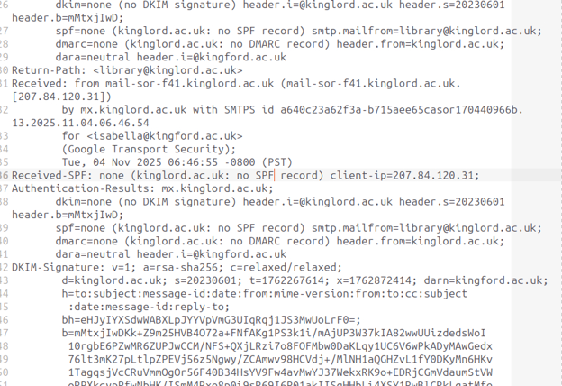
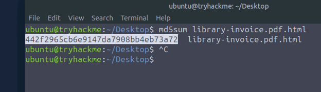
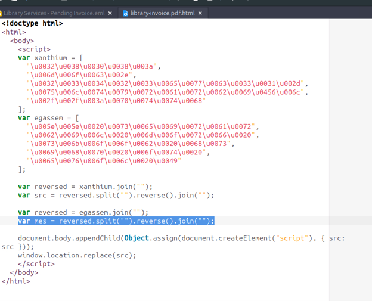
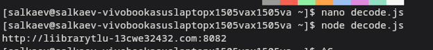
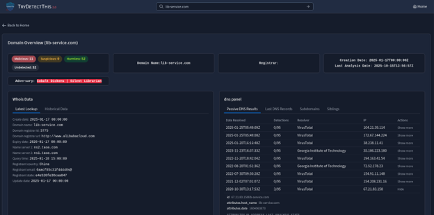
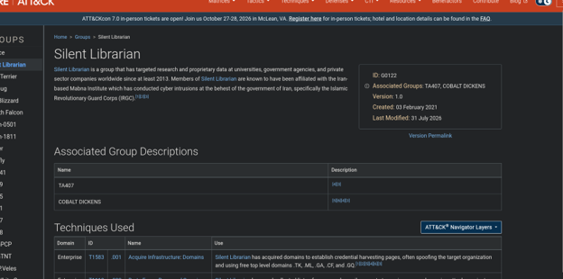

# Incident Report: Academic Phishing Campaign & Credential Harvesting

**Incident Type:** Email Spoofing / Typosquatting / Obfuscated JavaScript Redirect / Credential Harvesting  
**Status:** Completed  
**Date of Analysis:** October 1, 2026  
**Environment:** TryHackMe – SOC Simulation Exercise

## Executive Summary

An investigation into a suspicious email received by an academic institution revealed a targeted phishing campaign designed to harvest user credentials. The attacker leveraged a typosquatted domain (`kinglord.ac.uk`) to impersonate a legitimate library service. Due to the absence of SPF, DKIM, and DMARC records on the attacker's domain, the email successfully bypassed standard email authentication checks. 

The email delivered an HTML attachment disguised as a PDF invoice. Inside the attachment, heavily obfuscated JavaScript decoded a URL and redirected the victim to a malicious credential harvesting page (`lib-service.com:8083`). Threat intelligence correlates this infrastructure and TTPs to the threat actor group known as "Silent Librarian" (Cobalt Dickens), which targets academic and research institutions.

## Investigation Workflow

The investigation followed a structured SOC workflow utilizing email header analysis and static/dynamic malware analysis:

1. **Email Header Analysis** – Identify sender spoofing and authentication failures.  
2. **Attachment Analysis** – Identify the file type and calculate cryptographic hashes.  
3. **Payload Deobfuscation** – Decode the embedded JavaScript to extract the hidden URL and attacker messages.  
4. **Infrastructure & Threat Intel Correlation** – Analyze the landing page and correlate IoCs with known threat actors.  
5. **IoC Extraction** – Compile indicators of compromise for remediation.

---

## 1. Initial Access & Defense Evasion

Analysis of the email headers revealed that the attacker spoofed a legitimate academic domain. The email originated from `library@kinglord.ac.uk` and was sent to `isabella@kingford.ac.uk`. The attacker used **typosquatting** (registering a look-alike domain) to deceive the recipient. The email bypassed security filters because the sender's domain lacked proper email authentication records.

* **Sender IP:** `207.84.120.31` (mail-sor-f41.kinglord.ac.uk)
* **Authentication Results:** `spf=none`, `dkim=none`, `dmarc=none`

The absence of a DMARC policy (`DMARC=none`) explicitly explains why the email platform did not reject the message.

  
*Figure 1 – Email headers showing the absence of SPF, DKIM, and DMARC records.*

## 2. Attachment Analysis

The email contained a malicious attachment designed to look like a standard document.

| Field | Value |
|-------|-------|
| **File Name** | `library-invoice.pdf.html` |
| **File Extension** | `.html` |
| **MD5 Hash** | `442f2965cb6e9147da7908bb4eb73a72` |

The double extension (`.pdf.html`) is a common social engineering tactic to trick the user into executing an HTML file, which opens in the browser rather than a PDF reader. The MD5 hash was calculated using the `md5sum` command in the Linux terminal.

  
*Figure 2 – Calculation of the MD5 hash for the malicious HTML attachment.*

## 3. Payload Deobfuscation & Execution

Upon opening the HTML file, the browser executes heavily obfuscated JavaScript. The script uses Unicode escape sequences stored in arrays named `xanthium` and `egassem` to hide its true intent. 

  
*Figure 3 – Obfuscated JavaScript arrays within the HTML file.*

* **Hidden Attacker Message:** Decoding the `egassem` array reveals the attacker's taunt: `I love to phish books from libraries ^^`
* **Decoding Mechanism:** The script concatenates and reverses the strings to reconstruct a URL. The specific line responsible for this decoding is:
    `var src = reversed.split("").reverse().join("");`
* **MITRE Technique:** This behavior aligns with **T1027 - Obfuscated Files or Information**.

The script dynamically appends a new script element to the document body, forcing a redirect to the first URL in the chain: `http://liibrarytlu-13cwe32432.com:8082` (Punycode: `http://xn--librarytlu-13cwe32432-kwr.com:8082`). A Node.js script (`decode.js`) was used to simulate the JavaScript execution and extract the final URL.

  
*Figure 4 – Execution of the decoding script revealing the first redirect URL.*

## 4. Infrastructure & Threat Intel Correlation

The redirect chain ultimately leads to the credential harvesting landing page: `http://lib-service.com:8083`.

Analysis of `lib-service.com` via threat intelligence tools reveals:
* **Creation Date:** January 17, 2025
* **Registrar:** Alibaba Cloud
* **Registrant Country:** China
* **Adversary Attribution:** Cobalt Dickens | Silent Librarian

The domain `lib-service.com` is explicitly associated with known malicious infrastructure used by state-sponsored actors targeting universities and research entities.

  
*Figure 5 – Threat intelligence dashboard showing domain reputation and attribution.*

## 5. Threat Actor Profile

* **Associated Groups:** Cobalt Dickens, TA407, G0122 (Silent Librarian)
* **Target:** Research and Proprietary Data
* **Objective:** The primary goal of this campaign is cyberespionage, specifically targeting academic and intellectual property to steal research data.

  
*Figure 6 – MITRE ATT&CK page for Silent Librarian (G0122) detailing associated groups and techniques.*

---

## 6. Indicators of Compromise (IoC)

### Network Indicators
| Type | Value |
|------|-------|
| **Attacker IP** | `207.84.120.31` |
| **Sender Domain** | `kinglord.ac.uk` |
| **First Redirect URL** | `http://liibrarytlu-13cwe32432.com:8082` |
| **Landing Page URL** | `http://lib-service.com:8083` |

### File Indicators & Hashes
| File Path / Name | Hash Type | Hash Value |
|------------------|-----------|------------|
| `library-invoice.pdf.html` | MD5 | `442f2965cb6e9147da7908bb4eb73a72` |

---

## 7. MITRE ATT&CK Mapping

| Technique | ID | Description |
|-----------|----|-------------|
| **Acquire Infrastructure: Domains** | T1583.001 | Used typosquatting to acquire domains for credential harvesting pages. |
| **Obfuscated Files or Information** | T1027 | Used JavaScript obfuscation to hide the redirect URL and evade detection. |
| **Phishing: Spearphishing Attachment** | T1566.001 | Delivered a malicious HTML file via email to the target. |

---

## 8. Conclusion & Recommendations

The investigation confirmed a targeted phishing attempt leveraging a typosquatted domain and an obfuscated HTML attachment to redirect the user to a credential harvesting site. The campaign aligns with the Silent Librarian threat actor's known TTPs.

**Recommendations:**

1. **Immediate Blocking** – Block the sender IP `207.84.120.31`, the domain `kinglord.ac.uk`, and the landing page `lib-service.com` at the email gateway and firewall level.
2. **Email Authentication** – Enforce strict DMARC (`p=reject`), SPF, and DKIM policies to prevent spoofing of legitimate domains.
3. **Attachment Filtering** – Block or quarantine `.html` attachments at the email gateway, as they are frequently used to deliver obfuscated JavaScript redirects.
4. **User Awareness** – Conduct training to educate users on identifying typosquatted domains and the risks of opening unexpected HTML attachments.
5. **Credential Reset** – If any user interacted with the landing page, force a password reset immediately.