# Linux Backdoor & Persistence Investigation Report

**Lab Environment:** Ubuntu 20.04.6 LTS (AWS EC2, Xen Virtualization)  
**Target Hostname:** `cybertees`  
**Tools Used:** `hostnamectl`, `journalctl`, `ps aux`, `grep`, `crontab`, `ls -a`, `dpkg`, `file`

---

## Objective

Simulate and document a complete investigation of a compromised Linux server to identify:

1. The persistent backdoor account created by the attacker.
2. The persistence mechanisms (cronjobs and services) set up by the attacker.
3. Hidden processes and files designed to evade detection.
4. The evidence of external attacks (SSH brute force) and the subsequent successful login.
5. The malicious software package installed on the host and its hidden secrets.

---

## Step 1 — Initial System Information & Identification

The investigation began by identifying the target system's basic configuration using the `hostnamectl` command.

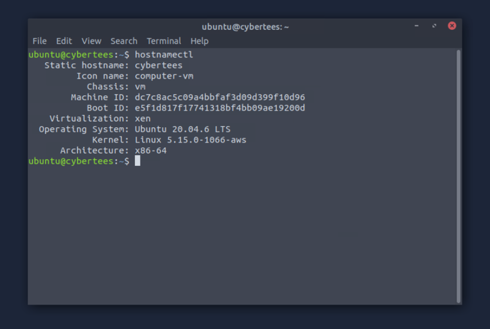

**System Details:**

| Attribute | Value |
|-----------|-------|
| Static hostname | `cybertees` |
| Icon name | `computer-vm` |
| Chassis | `vm` |
| Machine ID | `dc7c8ac5c09a4bbbfaf3d09d399f10d96` |
| Boot ID | `e5f1d817f17741318bf4bb09ae19200d` |
| Virtualization | `xen` |
| Operating System | `Ubuntu 20.04.6 LTS` |
| Kernel | `Linux 5.15.0-1066-aws` |
| Architecture | `x86-64` |

---

## Step 2 — Backdoor Account Creation

Reviewing the user-management logs revealed a newly created user account. The attacker added a user named `mircoservice` (intentional misspelling of "microservice") to bypass casual inspection.

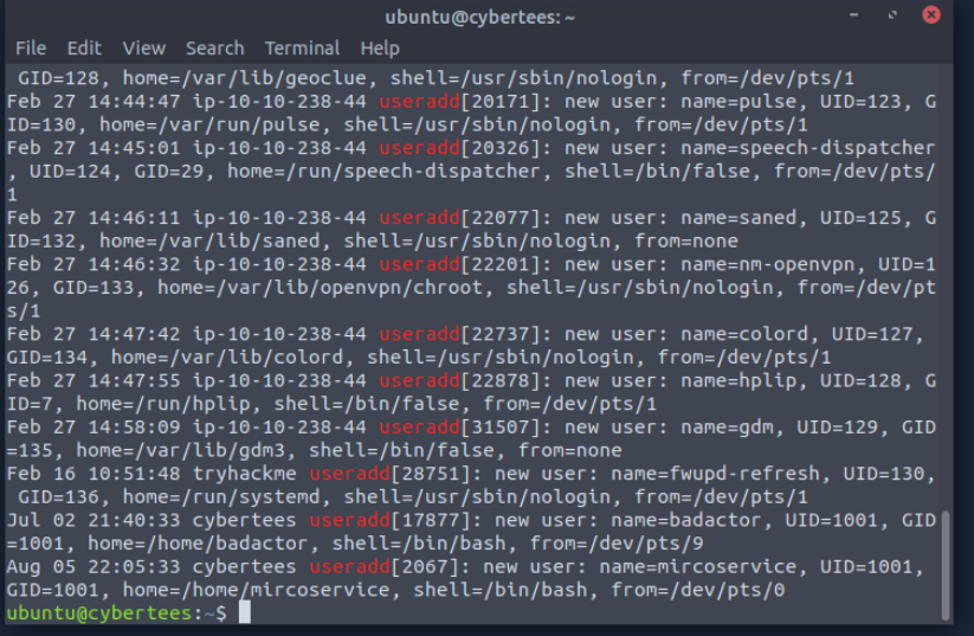

**Account Details:**

| Attribute | Value |
|-----------|-------|
| Username | `mircoservice` |
| UID / GID | `1001 / 1001` |
| Home Directory | `/home/mircoservice` |
| Shell | `/bin/bash` |
| Creation Time | **Aug 05 22:05:33** (from `/dev/pts/0`) |

The logs confirmed the user creation:

```
Aug 05 22:05:33 cybertees useradd[2067]: new user: name=mircoservice, UID=1001, GID=1001, home=/home/mircoservice, shell=/bin/bash, from=/dev/pts/0
```

*Note:* the same log also contains an earlier suspicious account `badactor` (Jul 02 21:40:33, UID 1001), but the active backdoor account in this incident is `mircoservice`.

---

## Step 3 — Persistence via Cronjob

Cron tables were inspected. The `mircoservice` user had no personal crontab (`no crontab for mircoservice`), but **root's** crontab contained a malicious entry that triggers a binary named `printer_app` on every system reboot.

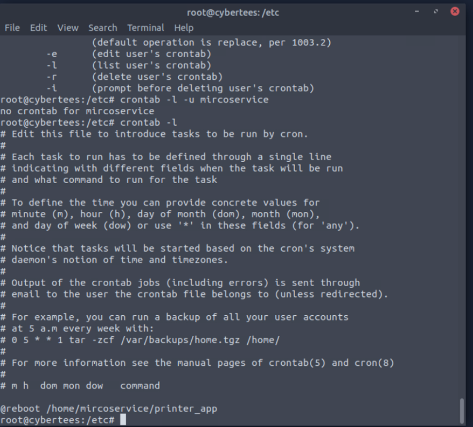

**Persistence Entry:**

```
@reboot /home/mircoservice/printer_app
```

This ensures that the attacker's payload executes automatically whenever the server restarts. Examining the binary itself (`cat /home/mircoservice/printer_app`) shows a compiled ELF executable containing process-manipulation strings such as `Child process PID: %d`, `Orphan process PID: %d` and `Orphan process parent PID: %d`, built with GCC 9.4.0 (Ubuntu 9.4.0-1ubuntu1~20.04.2) - consistent with a tool designed to fork and hide its own processes.

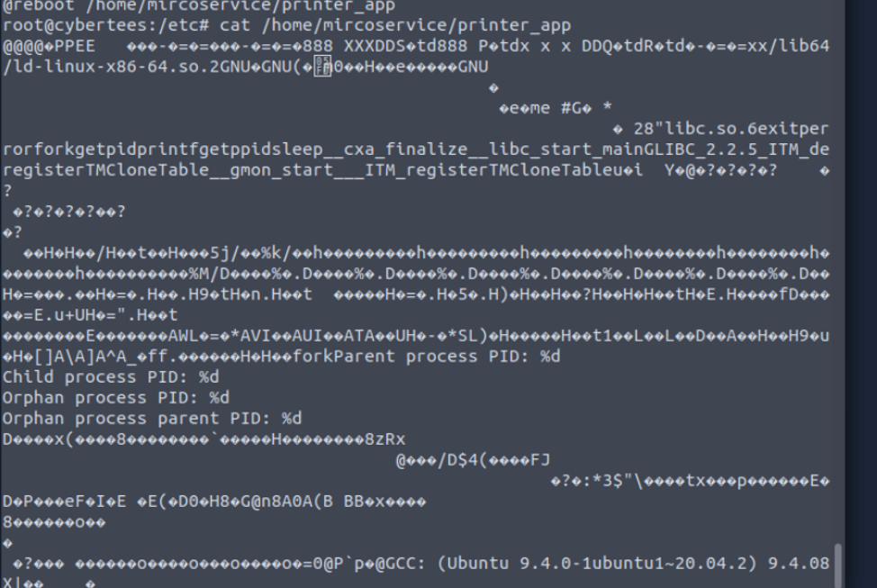

---

## Step 4 — Hidden Processes and Files

The attacker utilized deceptive naming conventions to hide their malware in plain sight.

### Hidden Processes

A process listing highlighted a suspicious hidden process `.strokes` (PID 575) running from a hidden directory inside the backdoor account's home:

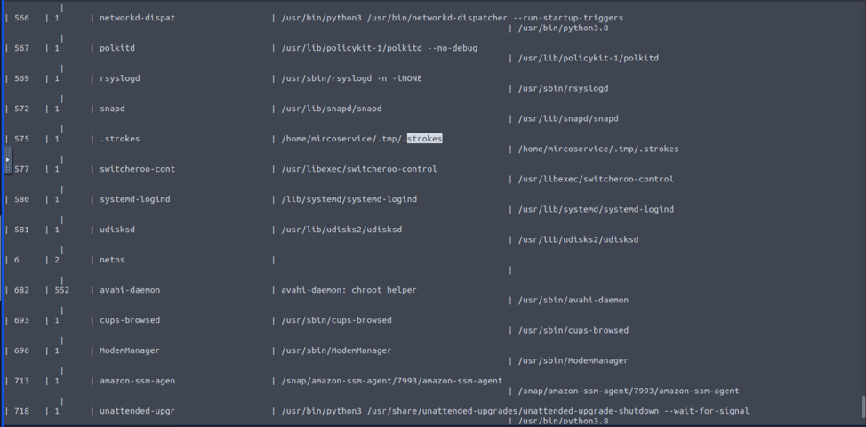

A targeted search (`ps aux | grep strokes` and `ps aux | grep mircoservice`) confirmed that exactly **2 processes** run from the backdoor account's directory:

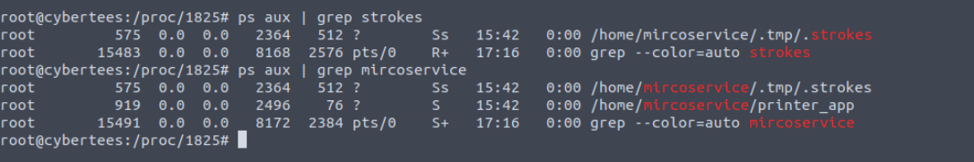

| Process Name | PID | Full Path | Note |
|--------------|-----|-----------|------|
| `.strokes` | 575 | `/home/mircoservice/.tmp/.strokes` | Hidden keylogger-style process |
| `printer_app` | 919 | `/home/mircoservice/printer_app` | Cronjob persistence binary |

### Hidden Files

Inspecting the backdoor home with `ls -a` revealed a hidden `.tmp` directory. Inside it, two files were found: the source code `strokes.c` and a binary named `systemd` - a fake system utility placed in a user directory to blend in with the legitimate `systemd` process name.

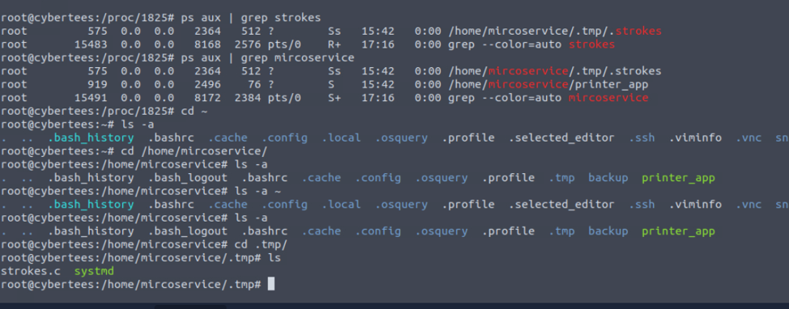

- **Hidden directory:** `/home/mircoservice/.tmp/`
- **Files:** `strokes.c` (source), `systemd` (disguised binary)

---

## Step 5 — Malicious Services Installed

The investigation of `journalctl` revealed two dangerous services created by the attacker to maintain persistence. Both services repeatedly failed at the EXEC step, confirming they were not part of the legitimate system configuration.

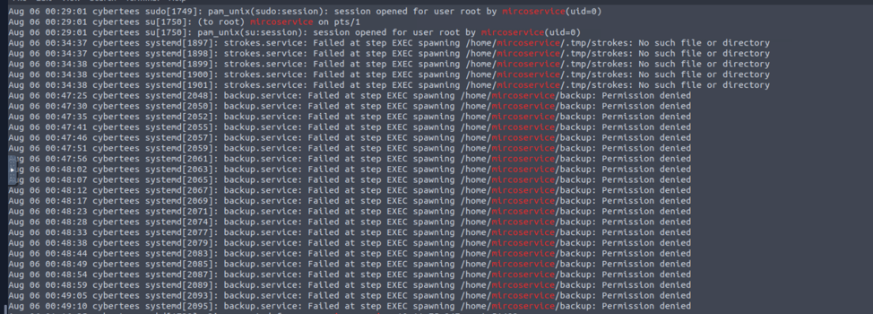

**Installed Services:**

1. `backup.service` - failed with `Permission denied` spawning `/home/mircoservice/backup`
2. `strokes.service` - failed with `No such file or directory` spawning `/home/mircoservice/.tmp/strokes`

The failures repeated in a loop on **Aug 06 00:13-00:15**. The same log also shows `mircoservice` opening `sudo` sessions as **root** (`pam_unix(sudo:session): session opened for user root by mircoservice`), indicating full privilege compromise.

---

## Step 6 — SSH Brute Force and Successful Login

Filtering the authentication logs for the backdoor account reconstructed the attack timeline: account creation at **22:05:33**, password change at **22:05:39**, followed by external SSH activity from a single source IP.

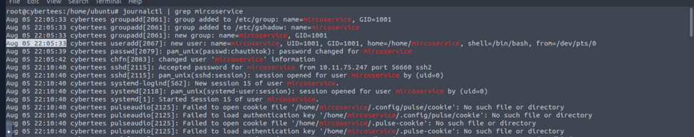

The brute-force phase produced multiple `Invalid user` / `Failed password` events from **10.11.75.247** (ports 56486, 56536, 56555):

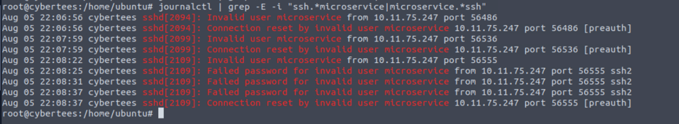

**Attack Details:**

| Attribute | Value |
|-----------|-------|
| Source IP Address | **10.11.75.247** |
| Target User | `mircoservice` |
| Failed Attempts | 3 x `Failed password` + multiple `Invalid user` / `Connection reset` entries (in the captured excerpt) |
| Successful Login | **Aug 05 22:10:40** - `Accepted password for mircoservice from 10.11.75.247 port 56660 ssh2` |

Log evidence:

```
Aug 05 22:08:25 cybertees sshd[2109]: Failed password for invalid user mircoservice from 10.11.75.247 port 56555 ssh2
Aug 05 22:10:40 cybertees sshd[2115]: Accepted password for mircoservice from 10.11.75.247 port 56660 ssh2
```

The attack therefore ended in a **successful interactive session** (Session 15) for the backdoor user.

---

## Step 7 — Malicious Package Installation

Using `dpkg` logs, a suspicious package named `pscanner` was identified as installed on the host outside the normal update cycle.

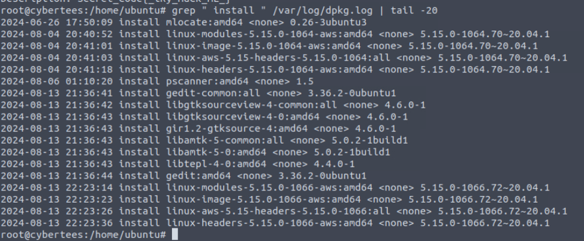

**Package Details:**

| Attribute | Value |
|-----------|-------|
| Package Name | `pscanner` |
| Version | `1.5` |
| Architecture | `amd64` |
| Maintainer | `JohnnyEng` |
| Installation Date | **2024-08-06 01:10:20** |
| Installed Binary | `/usr/local/bin/pscanner` (ELF 64-bit LSB shared object, x86-64, dynamically linked, not stripped) |

### Secret Code in Metadata

When inspecting the package metadata (`dpkg -s pscanner`), a hidden secret code was extracted from the `Description` field:

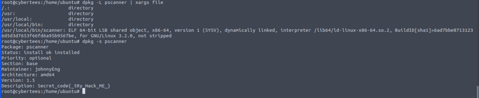

**Secret Code:** `[_tRy_Hack_ME_]`

---

## Result

The investigation successfully identified all key indicators of compromise (IOCs) on the infected server.

| Phase | Action | Status |
|-------|--------|--------|
| 1 | Identified Machine ID, OS and virtualization details | Done |
| 2 | Discovered backdoor user `mircoservice` created Aug 05 22:05:33 (UID 1001) | Done |
| 3 | Found persistence cronjob `@reboot /home/mircoservice/printer_app` in root's crontab | Done |
| 4 | Identified 2 malicious processes: `.strokes` (PID 575) and `printer_app` (PID 919) | Done |
| 5 | Found hidden files `/home/mircoservice/.tmp/systemd` and `strokes.c` | Done |
| 6 | Found malicious services `backup.service` and `strokes.service` (repeated EXEC failures) | Done |
| 7 | Detected SSH brute force from `10.11.75.247` and successful login at 22:10:40 | Done |
| 8 | Identified malicious package `pscanner` and secret `[_tRy_Hack_ME_]` | Done |

**Critical Findings:**

- **Backdoor User:** `mircoservice` (UID 1001)
- **Persistence:** `@reboot /home/mircoservice/printer_app`
- **Hidden Binary:** `/home/mircoservice/.tmp/.strokes` (PID 575)
- **Disguised File:** `/home/mircoservice/.tmp/systemd`
- **Malicious Services:** `backup.service`, `strokes.service`
- **Attacker IP:** `10.11.75.247` (brute force, then successful SSH login)
- **Secret Code:** `[_tRy_Hack_ME_]`

---

## Detection & Mitigation Recommendations

1. **Monitor User Creation:** Alert on `useradd` events with UID >= 1000 that occur outside normal business hours or from non-admin sessions.
2. **Audit Cronjobs:** Regularly review `/var/spool/cron/`, `/etc/crontab` and `/etc/cron.*` for entries pointing to user home directories (e.g., `@reboot /home/...`).
3. **Inspect Hidden Processes:** Use `ps aux` and `lsof` to monitor processes running from hidden directories (prefixed with `.`) or user homes.
4. **Review Systemd Services:** Monitor for new `.service` files and investigate any that fail repeatedly at the EXEC step or point to `/home/` paths.
5. **SSH Hardening:** Deploy fail2ban or similar tooling to block IPs generating repeated failed logins (like `10.11.75.247`), and disable password authentication where possible.
6. **Package Verification:** Audit `dpkg -l` / `/var/log/dpkg.log` for unknown packages with non-standard maintainers, and inspect metadata fields for hidden payloads.
7. **File Integrity Monitoring:** Implement AIDE/Tripwire to detect unexpected files in hidden directories such as `/home/*/.tmp`.