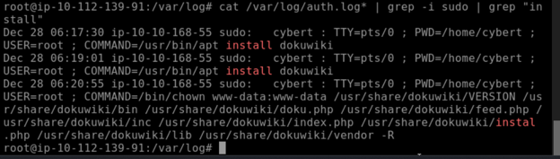
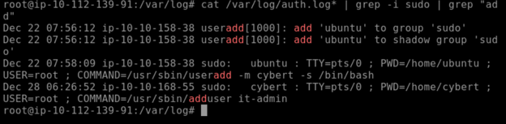
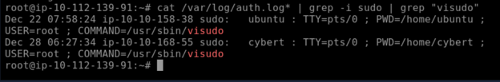
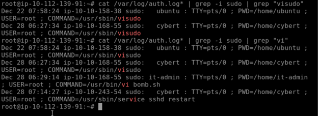
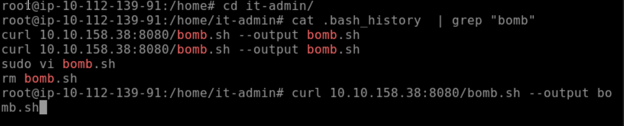
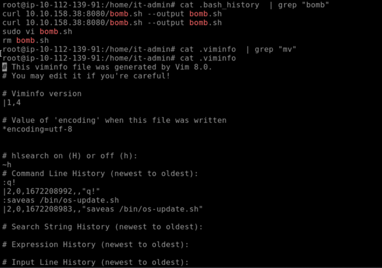
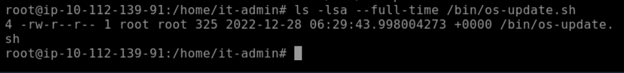
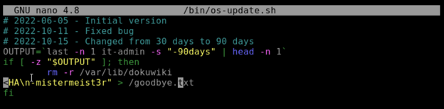
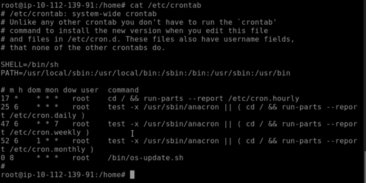

# Linux-Insider-Threat-&-Malicious-Cron-Job-Investigation

**Incident Type:** Insider Threat / Malicious Scheduled Job  
**Status:** Completed  
**Date of Analysis:** 8 July 2026  
**Environment:** TryHackMe – Linux Forensics Lab (simulated SOC exercise)

## Executive Summary

During a routine review of authentication logs on a production Linux server, evidence of unauthorised activities performed by a disgruntled IT user (`cybert`) was discovered. The user installed the `dokuwiki` package, created a new user (`it-admin`), and granted it `sudo` privileges by editing the `sudoers` file. Subsequently, a suspicious script named `bomb.sh` was downloaded from an internal IP (`10.10.158.38`) and later disguised as `/bin/os-update.sh` using the `vi` editor. This script contains destructive commands that remove the entire DokuWiki data directory and create a file (`/goodbye.xt`) with a threatening message. The script was scheduled to execute daily at 08:00 via `cron`. The host has been isolated, the malicious file removed, and the cron entry cleared. All user credentials have been rotated, and a full audit of system integrity is underway.

## Investigation Workflow

The investigation followed a structured forensic approach:

1. **Log Review** – analyse `sudo` logs to identify privileged commands.  
2. **User & Permission Analysis** – detect newly created users and modifications to `sudoers`.  
3. **Command History Analysis** – examine `.bash_history` and `.viminfo` for executed commands.  
4. **File System Analysis** – locate and inspect the malicious script.  
5. **Scheduled Task Analysis** – review `crontab` for persistent execution.  
6. **IoC Extraction** – compile indicators for remediation.  
7. **MITRE ATT&CK Mapping** – classify the attacker’s techniques.

---

## 1. Log Review – Privileged Commands

The investigation began by inspecting the authentication logs (`/var/log/auth.log*`) for all `sudo` commands executed on the system. The initial search focused on package installations.

  
*Figure 1 – The user `cybert` executed `apt install dokuwiki` twice on Dec 28, confirming an attempted installation of the DokuWiki package. The present working directory was `/home/cybert`.*

A subsequent search for user administration commands revealed the creation of a new user and the addition of another user to the system.

  
*Figure 2 – On Dec 22, the user `ubuntu` created the account `cybert` using `useradd`. Later, on Dec 28, `cybert` added `it-admin` using `adduser`, indicating the creation of a secondary user account.*

The next step was to check for modifications to the `sudoers` file, as this would grant elevated privileges to other users.

  
*Figure 3 – The `visudo` command was executed twice: once by `ubuntu` on Dec 22 and again by `cybert` on Dec 28 at 06:27:34. This suggests that `cybert` added `it-admin` to the `sudo` group or otherwise granted privileges.*

Finally, a broader grep for `vi` showed that `it-admin` opened `bomb.sh` using `vi`, and `cybert` restarted `sshd`.

  
*Figure 4 – The user `it-admin` ran `vi bomb.sh` on Dec 28 at 06:29:14, and `cybert` restarted `sshd` later that day. The `bomb.sh` file was created earlier from a `curl` download.*

---

## 2. Command History & File Reconstruction

The `.bash_history` of the `it-admin` user was examined to trace the origin of `bomb.sh`.

  
*Figure 5 – The user executed `curl` to download `bomb.sh` from `10.10.158.38:8080` and saved it locally. The file was then opened with `sudo vi` and later removed with `rm`.*

However, the file was not truly deleted; it was renamed and moved using `vi`’s `:saveas` command, as revealed by `.viminfo`.

  
*Figure 6 – The `.viminfo` file records the command `:saveas /bin/os-update.sh`, confirming that `bomb.sh` was saved as a system‑wide script under `/bin/os-update.sh`.*

The file `/bin/os-update.sh` still existed on the filesystem with a modification timestamp of Dec 28 06:29:43.

  
*Figure 7 – The file is owned by `root` and was last modified on Dec 28 at 06:29:43, matching the time of the `vi` session. Its size is 325 bytes.*

---

## 3. Malicious Script Analysis

The content of `/bin/os-update.sh` was inspected and revealed destructive intent.

  
*Figure 8 – The script attempts to check if `it-admin` has logged in within the last 90 days. If not, it recursively deletes the DokuWiki data directory and writes a message (`HA\n-mistermeist3r" > /goodbye.xt`). Note the typo in the output file name (`/goodbye.xt`), which is likely intended to be `/goodbye.txt`.*

This script is clearly a backdoor or a data‑destruction mechanism disguised as an operating system update.

---

## 4. Scheduled Execution – Cron Job

To determine how the script would be triggered, the system‑wide `crontab` was reviewed.

  
*Figure 9 – A cron entry was added to execute `/bin/os-update.sh` every day at 08:00 (the line `08 * * * * root /bin/os-update.sh`). This ensures the malicious script runs daily.*

---

## 5. Indicators of Compromise (IoC)

### Network Indicators (internal)

| Type | Value |
|------|-------|
| **Source IP (attacker)** | `10.10.158.38` (used for downloading `bomb.sh`) |
| **Port** | `8080` |

### File Indicators

| File Path | Description |
|-----------|-------------|
| `/home/it-admin/bomb.sh` | Original malicious script (deleted) |
| `/bin/os-update.sh` | Disguised script (still present at time of analysis) |
| `/goodbye.xt` | Output file created by the script (if triggered) |

### User & Privilege Indicators

- **User accounts created**: `cybert`, `it-admin`
- **Sudo privilege modifications**: `visudo` executed on Dec 28 06:27:34 (likely granting `it-admin` full sudo rights)
- **Suspicious command**: `/usr/bin/vi bomb.sh` executed as `it-admin` with `sudo`

### Scheduled Task

- **Cron entry**: `08 * * * * root /bin/os-update.sh` – runs daily at 08:00 (system time)

---

## 6. MITRE ATT&CK Mapping

| Technique | ID | Description |
|-----------|----|-------------|
| **Valid Accounts: Local Accounts** | T1078.003 | The attacker used existing accounts (`cybert`, `it-admin`) with valid credentials. |
| **Ingress Tool Transfer** | T1105 | `curl` was used to download `bomb.sh` from a remote host. |
| **Scheduled Task/Job: Cron** | T1053.003 | The malicious script was added to the system‑wide `crontab`. |
| **Data Destruction** | T1485 | The script deletes the `/var/lib/dokuwiki` directory, causing data loss. |
| **File and Directory Permissions Modification** | T1222 | The `chown` command was used to change ownership of DokuWiki files. |
| **Create or Modify System Process** | T1543 | The script was placed in `/bin/` to masquerade as a system binary. |

---

## 7. Conclusion & Recommendations

The investigation confirmed that a disgruntled IT user (`cybert`) compromised the system by installing DokuWiki, creating a backdoor user (`it-admin`), and deploying a destructive scheduled script. The script would have deleted the entire DokuWiki data and left a threatening message if executed. The host was running the script daily at 08:00, but no execution logs were found, suggesting that either the cron job had not yet run or it had been interrupted. Nevertheless, the risk of data loss was high.

**Recommended Actions:**

1. **Remove the malicious script**: `rm /bin/os-update.sh`.
2. **Delete the cron entry**: edit `/etc/crontab` and remove the line `08 * * * * root /bin/os-update.sh`.
3. **Review and revoke unnecessary sudo privileges** for `it-admin` and any other suspicious users.
4. **Disable or remove the `it-admin` account** (if not needed) and change passwords for `cybert` and `root`.
5. **Audit all system binaries** in `/bin` and `/usr/bin` for other unexpected files.
6. **Check for persistence mechanisms** such as systemd timers, `rc.local`, or `init.d` scripts.
7. **Back up critical data** and verify the integrity of the DokuWiki installation; consider restoring from a clean backup.
8. **Implement logging and monitoring** for `sudo` usage and cron modifications to detect future incidents.
9. **Conduct user awareness training** regarding the risks of insider threats and privilege misuse.