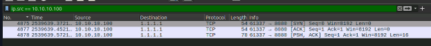
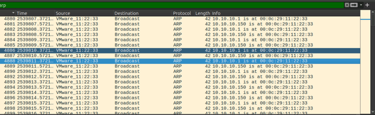
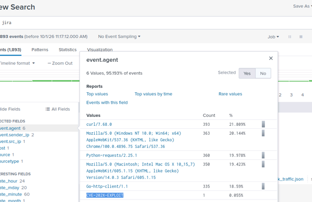
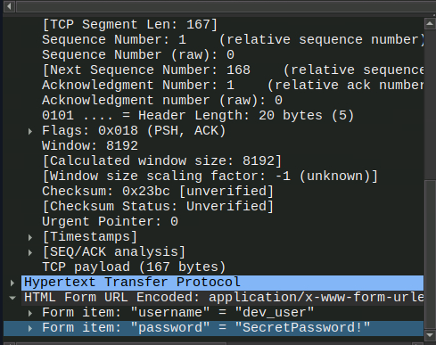
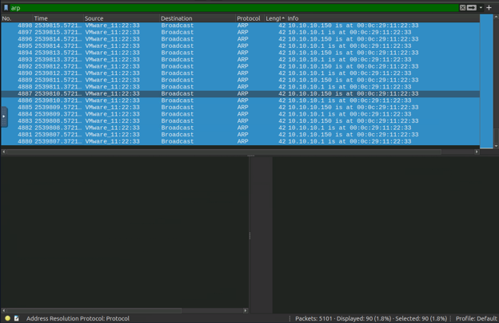
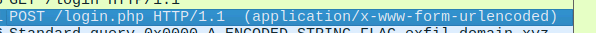

# Incident Report: Network Forensic Investigation – ARP Spoofing, C2 Communication & DNS Exfiltration

**Incident Type:** Adversary-in-the-Middle (AiTM) / Credential Harvesting / Command & Control (C2) / Data Exfiltration  
**Status:** Completed  
**Date of Analysis:** October 1, 2026  
**Environment:** TryHackMe – SOC Simulation Exercise

## Executive Summary

An investigation into suspicious network activity within a corporate environment revealed a multi-stage compromise. An internal host (`10.10.10.100`) was infected and initiated communication with an external Command & Control (C2) server. The attacker performed ARP spoofing to intercept network traffic, successfully captured plaintext credentials from a Jira login POST request, and utilized DNS tunneling to exfiltrate data to an attacker-controlled domain. The investigation utilized a combination of Wireshark PCAP analysis and Kibana (Elastic Stack) SIEM log correlation.

## Investigation Workflow

The investigation followed a structured SOC workflow utilizing network traffic analysis and SIEM telemetry:

1. **Network Traffic Analysis (Wireshark)** – Identify suspicious outbound connections and C2 channels.
2. **ARP Analysis** – Detect ARP spoofing and gateway impersonation.
3. **HTTP Payload Analysis** – Extract credential harvesting attempts from POST requests.
4. **DNS & Exfiltration Analysis** – Identify data exfiltration techniques via DNS queries.
5. **SIEM Correlation (Kibana)** – Identify anomalous User-Agents hitting internal applications (Jira).
6. **IoC Extraction** – Compile indicators of compromise for remediation.

---

## 1. Initial Access & Command & Control (C2)

Analysis of the PCAP revealed suspicious outbound traffic originating from an internal IP address. The host was attempting to communicate with an external IP on a non-standard port, indicating a potential C2 channel.

* **Internal Source IP:** `10.10.10.100`
* **External C2 IP:** `1.1.1.1`
* **Destination Port:** `8080`
* **Protocol:** TCP

  
*Figure 1 – Wireshark displaying TCP SYN and PSH, ACK packets to the external C2 server on port 8080.*

Correlating this network activity with SIEM logs (Kibana), a search for "jira" revealed an anomalous User-Agent hitting the Jira instance. The log highlights a single event using a highly suspicious User-Agent string indicative of an automated exploit attempt.

* **Malicious User-Agent:** `CVE-202X-EXPLOIT`

  
*Figure 2 – Kibana dashboard showing the anomalous User-Agent 'CVE-202X-EXPLOIT' interacting with the Jira application.*

## 2. Adversary-in-the-Middle (ARP Spoofing)

The attacker performed ARP spoofing to position themselves between the internal network and the gateway. Wireshark analysis revealed a high volume of ARP broadcasts claiming that the gateway IP (`10.10.10.1`) was located at a specific MAC address. This is a classic ARP poisoning technique used to intercept network traffic.

* **Impersonated Gateway IP:** `10.10.10.1`
* **Attacker MAC Address:** `00:0c:29:11:22:33`
* **Number of Spoofed ARP Packets:** `90`

  
*Figure 3 – Wireshark capture showing continuous ARP broadcasts from the attacker's MAC address claiming to be the gateway.*

  
*Figure 4 – Wireshark status bar confirming 90 displayed ARP spoofing packets out of 5101 total packets.*

## 3. Credential Harvesting

Following the successful ARP spoofing, the attacker intercepted unencrypted HTTP traffic. Analysis of a POST request to a login endpoint (`/login.php`) revealed that credentials were being transmitted in plaintext within the HTTP payload.

* **HTTP Method:** `POST /login.php HTTP/1.1`
* **Content-Type:** `application/x-www-form-urlencoded`
* **Extracted Credentials:**
    * **Username:** `dev_user`
    * **Password:** `SecretPassword!`

  
*Figure 5 – Wireshark packet details showing the plaintext username and password in the HTML Form URL Encoded payload.*

## 4. Data Exfiltration via DNS

Further analysis of the network traffic revealed the attacker utilizing DNS queries to exfiltrate data. The DNS queries contained encoded strings sent to an attacker-controlled domain, a technique known as DNS tunneling.

* **Exfiltration Domain:** `exfil-domain.xyz`
* **Protocol Used:** DNS
* **Evidence:** The query `Standard query 0x0000 A ENCODED STRING FLAG.exfil-domain.xyz` indicates data being appended to the subdomain and sent to the attacker's authoritative DNS server.

  
*Figure 6 – Wireshark capture showing DNS queries with encoded strings directed to the malicious exfiltration domain.*

---

## 5. Indicators of Compromise (IoC)

### Network Indicators
| Type | Value |
|------|-------|
| **Internal Compromised Host** | `10.10.10.100` |
| **C2 Server IP** | `1.1.1.1` |
| **C2 Port** | `8080` |
| **Attacker MAC Address** | `00:0c:29:11:22:33` |
| **Impersonated Gateway IP** | `10.10.10.1` |
| **Exfiltration Domain** | `exfil-domain.xyz` |
| **Malicious User-Agent** | `CVE-202X-EXPLOIT` |

### Credential Indicators
| Type | Value |
|------|-------|
| **Compromised Username** | `dev_user` |
| **Compromised Password** | `SecretPassword!` |

---

## 6. MITRE ATT&CK Mapping

| Technique | ID | Description |
|-----------|----|-------------|
| **Adversary-in-the-Middle: ARP Cache Poisoning** | T1557.002 | Used ARP spoofing to intercept network traffic between the host and the gateway. |
| **Command and Control: Application Layer Protocol** | T1071.001 | Utilized HTTP (port 8080) to communicate with the C2 server. |
| **Credential Access: Network Sniffing** | T1040 | Captured plaintext credentials from unencrypted HTTP POST requests. |
| **Exfiltration Over Alternative Protocol: DNS** | T1048.003 | Used DNS tunneling to exfiltrate data to `exfil-domain.xyz`. |
| **Exploit Public-Facing Application** | T1190 | Attempted exploitation of the Jira instance using a CVE-specific User-Agent. |

---

## 7. Conclusion & Recommendations

The investigation confirmed a severe network compromise involving ARP spoofing, credential theft, and data exfiltration. The attacker successfully positioned themselves as a man-in-the-middle to intercept unencrypted traffic and established a C2 channel and exfiltration path.

**Recommendations:**

1. **Immediate Isolation** – Disconnect the compromised host `10.10.10.100` from the network to prevent further data loss.
2. **Credential Reset** – Immediately reset the password for `dev_user` and enforce multi-factor authentication (MFA) across all internal applications, especially Jira.
3. **Network Segmentation & Encryption** – Enforce HTTPS/TLS for all internal web applications to prevent plaintext credential interception. Implement Dynamic ARP Inspection (DAI) on network switches to prevent ARP spoofing.
4. **Block Indicators** – Block the C2 IP `1.1.1.1`, the exfiltration domain `exfil-domain.xyz`, and the malicious User-Agent `CVE-202X-EXPLOIT` at the firewall, proxy, and SIEM levels.
5. **DNS Security** – Implement DNS filtering and monitoring to detect and block DNS tunneling attempts to unknown or suspicious domains.
6. **Patch Management** – Ensure the Jira instance and all public-facing applications are fully patched against known vulnerabilities.