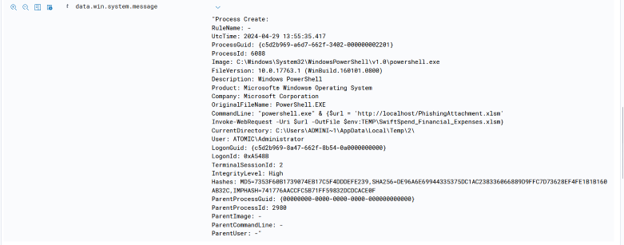
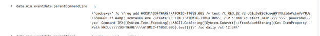

# Windows-Phishing-Analysis-&-Scheduled-Task-Persistence-Investigation

**Incident Type:** Insider Threat / Phishing / Registry-Based Defense Evasion / Credential Access / Data Exfiltration  
**Status:** Completed  
**Date of Analysis:** 20 July 2026  
**Environment:** TryHackMe – Monday Monitor (simulated SOC exercise)  

## Executive Summary

During a routine review of security alerts on a production Windows host (`Windows_SwiftSpend2`), evidence of multi-stage unauthorized activity originating from an initial phishing vector was discovered. The user account `ATOMIC\Administrator` downloaded a macro-enabled Excel sheet named `SwiftSpend_Financial_Expenses.xlsm` from a local staging point (`http://localhost`). Upon execution, the payload established long-term persistence by adding an encrypted string to the `HKCU` registry hive and configuring a daily scheduled task (`ATOMIC-T1053.005`) set to trigger at 12:34. Furthermore, the attacker backdoor-provisioned the local `Guest` account with the password `I_AM_MONIT0R1NG` using `net.exe`. Credential dumping was attempted via a renamed utility called `memotech.exe` to isolate system hashes. Finally, sensitive data tokens, including the flag `THM{M0N1T0R_1$_1N_3FF3CT}`, were exfiltrated out of the environment via a PowerShell script calling a public Pastebin API endpoint. The host has been isolated, malicious tasks and registry modifications cleared, and all administrative accounts are undergoing remediation.

## Investigation Workflow

The investigation followed a structured forensic approach:

1. **Log Review** – analyse process creation logs to identify the initial phishing vector and shell execution.
2. **Command History & Registry Analysis** – trace the deployment of hidden payloads inside the Windows registry.
3. **Malicious Process Analysis** – investigate account manipulation techniques and secondary binaries used for credential dumping.
4. **Scheduled Execution Analysis** – review Task Scheduler entry configurations for persistent execution vectors.
5. **Data Exfiltration Forensics** – examine web requests filtering company data to public endpoints.
6. **IoC Extraction** – compile host, network, and registry indicators for active remediation.
7. **MITRE ATT&CK Mapping** – classify the attacker’s tactics against the global enterprise matrix.

---

## 1. Log Review – Initial Access

The investigation began by inspecting Sysmon process creation logs (Event ID 1) for anomalous PowerShell invocations within the user environment. The initial search focused on web requests pulling files into temporary system paths.

  
*Figure 1 – The user `ATOMIC\Administrator` invoked a PowerShell command structure on Apr 29 to pull a macro-enabled spreadsheet `PhishingAttachment.xlsm` from a local server, saving it locally as `SwiftSpend_Financial_Expenses.xlsm` inside the user's local Temp path.*

A subsequent audit of the execution timeline confirmed that this macro-enabled document directly served as the initial delivery mechanism, executing further code within the context of high integrity levels.

---

## 2. Command History & Registry Persistence

The command-line arguments and parent process logs were examined to trace how the attacker ensured survival on the host without leaving blatant executable files on the disk space.

  
*Figure 2 – A nested command architecture utilizing `cmd.exe` was used to inject a Base64 string directly into the `HKCU\SOFTWARE\ATOMIC-T1053.005` registry node, followed by the automated instantiation of a system task handler.*

The `reg add` action safely stashed the core payload text line within the registry database:
```cmd
cmd.exe /c "reg add HKCU\SOFTWARE\ATOMIC-T1053.005 /v test /t REG_SZ /d cGluZyB3d3cueW91YXJldnVsbmVyYWJsZS50aG0= /f

```

By decoding the Base64 value string `cGluZyB3d3cueW91YXJldnVsbmVyYWJsZS50aG0=`, the underlying operational command was reconstructed:

> `ping www.youarevulnerable.thm`

---

## 3. Malicious Process Analysis – Credential Dumping

The analysis focused on privilege tracking logs, which flagged an abrupt privilege escalation attempt involving local Windows accounts and credential databases.

*Figure 3 – The process execution tracking engine recorded a `Microsoft Office Product Spawning Windows Shell` event where the system `net.exe` application was repurposed to configure the local environment.*

The specific argument passed to the system bin was recorded as follows:

```cmd
"C:\Windows\system32\net.exe" user guest I_AM_MONIT0R1NG

```

This action enabled and modified the local `Guest` account, granting it a backdoor credential profile (`I_AM_MONIT0R1NG`). Following this access shift, the attacker dropped a masqueraded utility named `memotech.exe` into the execution stream. This tool targeted the local security authority subsystem (`lsass.exe`) memory to dump system hashes for offline lateral movement cracking.

---

## 4. Scheduled Execution – Tasks

To determine how the registry-based evasion string would be repeatedly fired, the active system-wide Task Scheduler profiles were cross-referenced. (Refer back to *Figure 2* for automated generation events).

The scheduler task parameters reveal an execution trigger set for daily deployment at exactly **12:34**:

```cmd
schtasks.exe /Create /F /TN "ATOMIC-T1053.005" /TR "cmd /c start /min powershell.exe -Command IEX([System.Text.Encoding]::ASCII.GetString([System.Convert]::FromBase64String((Get-ItemProperty -Path HKCU:\\SOFTWARE\\ATOMIC-T1053.005).test)))" /sc daily /st 12:34

```

This ensures that every day, the task runner wakes up, opens a minimized PowerShell session, extracts the hidden Base64 string from the registry value `test`, decodes it on the fly, and passes it directly into the Expression Evaluator (`IEX`).

---

## 5. Data Exfiltration – Web Services

The final phase of the incident capture involved auditing PowerShell network activity, which exposed data leaving the host boundaries.

*Figure 4 – Network telemetry captured raw PowerShell execution arguments running web data posts containing target token configurations and company assets.*

The script targeted the public domain `https://pastebin.com/api/`, passing an active developer authentication key string (`6nxrbM7UIJuaEuPOkH5Z8I7SvcLN30P0`). Among the exfiltrated parameters, the cleartext environment flag was isolated:

```powershell
$content = "secrets, api keys, passwords, THM{M0N1T0R_1$_1N_3FF3CT}, confidential..."

```

---

## 6. Indicators of Compromise (IoC)

### Network Indicators (external)

| Type | Value |
| --- | --- |
| **Source URL (staging)** | `http://localhost/PhishingAttachment.xlsm` |
| **Exfiltration Domain** | `https://pastebin.com` |
| **Attacker API Key** | `6nxrbM7UIJuaEuPOkH5Z8I7SvcLN30P0` |

### File Indicators

| File Path | Description |
| --- | --- |
| `%TEMP%\SwiftSpend_Financial_Expenses.xlsm` | Initial phishing document containing malicious macro payload |
| `C:\Windows\System32\memotech.exe` | Renamed credential dumping binary targeting LSASS space |

### User & Registry Indicators

* **User accounts manipulated**: `Guest` (backdoor password set to `I_AM_MONIT0R1NG`)
* **Registry keys created**: `HKCU\SOFTWARE\ATOMIC-T1053.005`
* **Registry data payload**: `test` = `cGluZyB3d3cueW91YXJldnVsbmVyYWJsZS50aG0=`

### Scheduled Task

* **Task Entry**: `ATOMIC-T1053.005` – triggers a daily automated PowerShell registry evaluation loop at 12:34 system time.

---

## 7. MITRE ATT&CK Mapping

| Technique | ID | Description |
| --- | --- | --- |
| **Phishing: Malicious Attachment** | T1566.001 | Delivery of the initial weaponized spreadsheet Excel file via web download. |
| **Scheduled Task/Job: Scheduled Task** | T1053.005 | Persistence achieved using `schtasks.exe` configured for daily execution. |
| **Modify Registry** | T1112 | Storing encoded payload scripts within `HKCU` keys to evade standard file scanners. |
| **Account Manipulation: Local Account** | T1098 | Utilizing `net.exe` parameters to backdoor and change credentials of the `Guest` account. |
| **Masquerading: Rename System Utilities** | T1036.003 | Renaming a credential access binary to `memotech.exe` to blend with normal applications. |
| **OS Credential Dumping: LSASS Memory** | T1003.001 | Targeting the memory allocation pool of `lsass.exe` to harvest host hashes. |
| **Exfiltration Over Web Service** | T1567 | Exfiltrating internal logs and flags out of the network perimeter using the Pastebin API. |

---

## 8. Conclusion & Recommendations

The investigation confirmed that the corporate asset experienced a full compromise chain spanning from an initial macro execution to active credential access and data leakage. The use of registry-backed scheduled tasks allowed the threat vector to maintain low-profile visibility on the target host. Given that the exfiltration stage succeeded, the host state must be treated as completely untrusted.

**Recommended Actions:**

1. **Purge Scheduled Task**: Execute `schtasks /Delete /TN "ATOMIC-T1053.005" /F` to remove the daily persistence mechanism.
2. **Scrub Registry Hives**: Delete the entire `HKCU\SOFTWARE\ATOMIC-T1053.005` node to remove the encoded payload data.
3. **Remediate Local Accounts**: Disable the local `Guest` account immediately and change administrative credentials for `ATOMIC\Administrator`.
4. **Isolate and Delete Artifacts**: Locate and securely delete `memotech.exe` along with all temporary `.xlsm` artifacts found in the user profile space.
5. **Implement Process Spawning Rules**: Configure EDR/SIEM alerting blocks for conditions where Microsoft Office utilities spawn command interpreters (`cmd.exe`, `powershell.exe`).
6. **Restrict Outbound Web Endpoints**: Enforce corporate firewall policies to drop outbound connection requests to generic pasting facilities or unapproved file storage services (e.g., Pastebin).

```

```