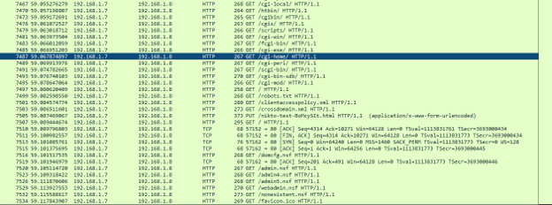
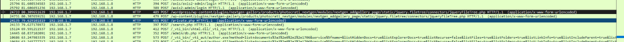
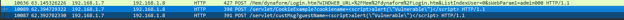
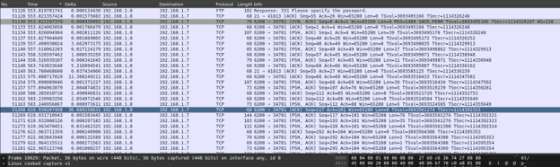
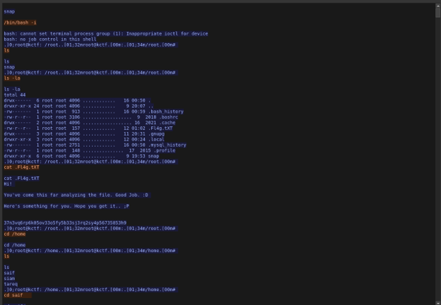
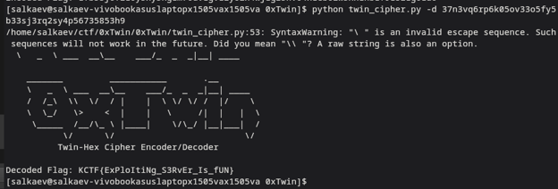
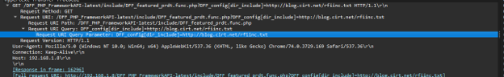

**Incident Report: Web Application Exploitation & Remote File Inclusion (RFI)**

**Incident Type:** Web Application Exploitation / Cross-Site Scripting (XSS) / Remote File Inclusion (RFI) / Reverse Shell
**Status:** Completed
**Date of Analysis:** October 26, 2026
**Environment:** CTF / SOC Simulation Exercise (Wireshark Network Traffic Analysis)

### Executive Summary

An investigation into a captured network traffic file (`dump`) revealed a successful compromise of a web server. The attacker (IP `192.168.1.7`) targeted a victim server (IP `192.168.1.8`) running a vulnerable version of WordPress with the NextGEN Gallery plugin. 

The attacker utilized the Nikto web scanner to identify the vulnerability, exploited it using Cross-Site Scripting (XSS) and Remote File Inclusion (RFI) techniques, and ultimately established a reverse shell on port `6000`. Post-exploitation activities included accessing the server's terminal, retrieving an encrypted string from a flag file, and using a Python cipher script to decode the final flag.

### Investigation Workflow

The investigation followed a structured forensic workflow utilizing Wireshark packet captures and terminal outputs:

1. **Network Traffic Analysis (Wireshark)** – Identify attacker/victim IPs and initial reconnaissance.
2. **HTTP Stream Analysis** – Detect XSS payloads and RFI attempts in web requests.
3. **Vulnerability Identification** – Correlate findings with known CVEs.
4. **Post-Exploitation Analysis** – Analyze terminal screenshots for commands executed and file retrievals.
5. **Decryption & Flag Extraction** – Decode the encrypted payload using the provided Python script.

---

### 1. Initial Access & Reconnaissance

Analysis of the network traffic identified the attacker's IP as `192.168.1.7` and the victim's IP as `192.168.1.8`. The attacker employed automated scanning tools to identify vulnerabilities on the victim's web server.

*   **Attacker IP:** `192.168.1.7`
*   **Victim IP:** `192.168.1.8`
*   **Tool Used:** Nikto (evidenced by requests to `http://blog.cirt.net/rfiinc.txt`)

The attacker used Cross-Site Scripting (XSS) payloads to test for input validation vulnerabilities. Wireshark logs show HTTP POST and GET requests containing malicious JavaScript.

*   **XSS Payload:** ``
*   **Targeted URIs:** `/servlet/cookieExample`, `/servlet/custMsg`

*Figure 1 – Wireshark capture showing XSS payloads injected into HTTP requests.*

*Figure 2 – HTTP GET requests targeting the web server.*

### 2. Vulnerability Exploitation & Remote File Inclusion

Further analysis revealed the vulnerable service was **WordPress**, specifically the **NextGEN Gallery** plugin. The vulnerability is identified as **CVE-2017-1000170**.

The attacker attempted Remote File Inclusion (RFI) by injecting an external URL into vulnerable parameters. The Wireshark capture shows the attacker trying to include `http://blog.cirt.net/rfiinc.txt` via parameters such as `DFF_config[dir_include]` and `TemplateDir`.

*   **Exploited Service:** WordPress (NextGEN Gallery plugin)
*   **CVE:** CVE-2017-1000170
*   **RFI Payload:** `http://blog.cirt.net/rfiinc.txt`
*   **Reverse Shell Port:** 6000

*Figure 3 – Wireshark capture showing RFI attempt via `DFF_config[dir_include]`.*

*Figure 4 – Wireshark capture showing RFI attempt via `TemplateDir`.*

*Figure 5 – TCP stream analysis showing the sequence of HTTP requests and potential reverse shell traffic.*

### 3. Post-Exploitation & Flag Capture

Following successful exploitation, the attacker gained terminal access to the victim server. The terminal history shows the attacker navigating the file system, reading a flag file, and executing a custom Python script to decrypt the payload.

1.  The attacker executed `cat FL4g.txt`, which returned a message and an encrypted hex string:
    *   *Message:* "H1! You've come this far analyzing the file. Good Job. :D Here's something for you. Hope you get it.. ;P"
    *   *Encrypted String:* `37n3vq6rp6k05ov3305fy5b33sj3rq2sy4p56735853h9`
2.  The attacker ran the provided decryption tool: `python twin_cipher.py -d 37n3vq6rp6k05ov3305fy5b33sj3rq2sy4p56735853h9`
3.  The script successfully decoded the flag.

*   **Decoded Flag:** `KCTF{Expl0ItiNg_S3RvEr_Is_fUN}`

*Figure 6 – Terminal output showing the retrieval of the encrypted flag string.*

*Figure 7 – Execution of the Python decryption script and successful flag extraction.*

*Figure 8 – Confirmation of the decoded flag `KCTF{Expl0ItiNg_S3RvEr_Is_fUN}`.*

---

### Indicators of Compromise (IoCs)

**Network Indicators**
| Type | Value |
| :--- | :--- |
| Attacker IP | `192.168.1.7` |
| Victim IP | `192.168.1.8` |
| Malicious URL | `http://blog.cirt.net/rfiinc.txt` |
| Reverse Shell Port | `6000` |

**File & Payload Indicators**
| Type | Value |
| :--- | :--- |
| XSS Payload | `` |
| CVE | `CVE-2017-1000170` |
| Encrypted Flag | `37n3vq6rp6k05ov3305fy5b33sj3rq2sy4p56735853h9` |
| Decoded Flag | `KCTF{Expl0ItiNg_S3RvEr_Is_fUN}` |

---

### MITRE ATT&CK Mapping

| Technique | ID | Description |
| :--- | :--- | :--- |
| Active Scanning | T1595 | Use of Nikto to scan for web vulnerabilities (evidenced by RFI test files). |
| Exploit Public-Facing Application | T1190 | Exploitation of CVE-2017-1000170 in the WordPress NextGEN Gallery plugin. |
| Command and Scripting Interpreter | T1059 | Use of Python and Bash terminal commands for post-exploitation and decryption. |
| Exfiltration Over C2 Channel | T1041 | Retrieval of the flag file and subsequent decryption. |

---

### Conclusion & Recommendations

The investigation confirmed that the victim's web server was fully compromised through a combination of unpatched software (WordPress NextGEN Gallery) and weak input validation. The attacker successfully leveraged RFI to execute arbitrary code and establish a reverse shell, leading to the exfiltration of sensitive data.

**Recommendations:**

1.  **Patch Management** – Immediately update WordPress core, themes, and plugins, specifically the NextGEN Gallery plugin, to patch CVE-2017-1000170.
2.  **Input Validation** – Implement strict server-side input validation and sanitization to prevent XSS and RFI attacks. Disable `allow_url_include` in PHP configurations.
3.  **Network Blocking** – Block the attacker IP `192.168.1.7` and blacklist outbound connections to `blog.cirt.net` at the firewall level.
4.  **Web Application Firewall (WAF)** – Deploy a WAF to detect and block common web exploitation patterns like `<script>` tags and external file inclusion attempts.
5.  **System Hardening** – Restrict outbound network traffic from web servers to prevent reverse shell callbacks on unexpected ports (e.g., port 6000).