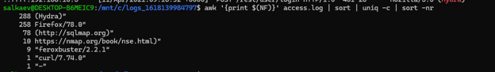
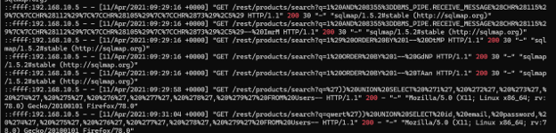
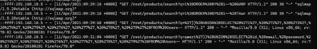
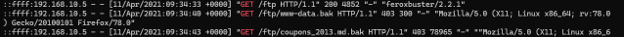
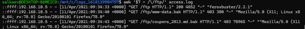
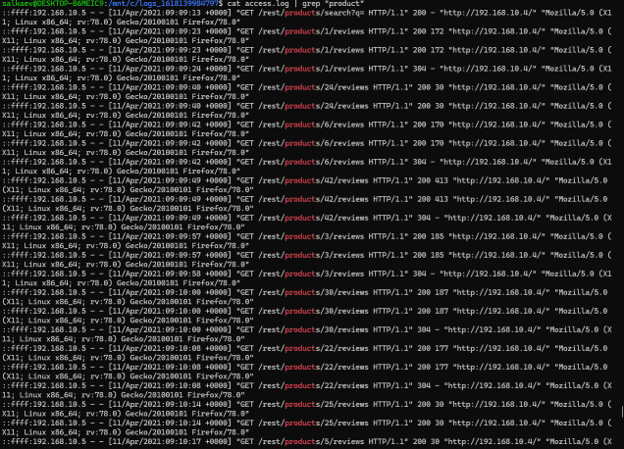
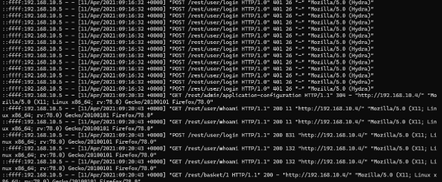
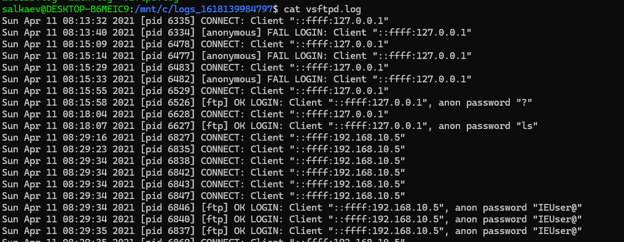
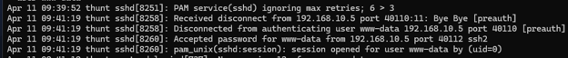

# Web Application & Server Compromise Investigation

**Incident Type:** Web Application Attack / Data Exfiltration / Server Compromise
**Status:** Completed
**Date of Analysis:** 10 July 2026

---

## Executive Summary

A systematic attack against a web application and its underlying infrastructure was detected through analysis of access logs, FTP logs, and authentication logs. The attacker employed a combination of automated tools — `nmap`, `hydra`, `sqlmap`, `feroxbuster`, and `curl` — to enumerate the web application, identify vulnerabilities, and exfiltrate sensitive data. A successful SQL injection on the `/rest/products/search` endpoint allowed the attacker to retrieve user credentials (email and password). The attacker also abused the FTP service to download backup files (`www-data.bak` and `coupons_2013.md.bak`) using anonymous authentication. Ultimately, the attacker gained shell access via SSH as the `www-data` user. The host was isolated, compromised credentials were rotated, and vulnerable endpoints were patched.

---

## Investigation Workflow

The investigation followed a structured forensic approach:

1. **Tool Identification** – analyse HTTP `User-Agent` strings to identify attacker tools.
2. **SQL Injection Analysis** – review abnormal query strings and response codes.
3. **Directory Enumeration** – identify discovered endpoints and file retrieval attempts.
4. **FTP Access Review** – examine `vsftpd.log` for successful logins and file downloads.
5. **Privilege Escalation** – review SSH authentication logs for shell access.
6. **IoC Extraction** – compile indicators for remediation.
7. **MITRE ATT&CK Mapping** – classify the attacker's techniques.

---

## 1. Tool Identification – `User-Agent` Analysis

The investigation began with a frequency analysis of the last field (the `User-Agent` string) from the access log to identify the tools used by the attacker.

```bash
awk '{print $(NF)}' access.log | sort | uniq -c | sort -nr
```

**Figure 1 – User-Agent frequency analysis**



The output reveals a clear pattern: Hydra was the most frequently used tool, followed by Firefox/78.0 (likely manual browsing), sqlmap, nmap (via NSE scripts), feroxbuster, and curl. The presence of `"_"` suggests a malformed or custom User-Agent.

| Tool | Occurrences | Purpose |
|---|---|---|
| Hydra | 288 | Brute-force attack against login endpoint |
| Firefox/78.0 | 258 | Manual reconnaissance |
| sqlmap | 78 | Automated SQL injection exploitation |
| nmap | 10 | Network/service scanning |
| feroxbuster | 9 | Directory and file brute-forcing |
| curl | 1 | Ad-hoc HTTP requests |

---

## 2. SQL Injection Analysis

The attacker used sqlmap to probe the `/rest/products/search` endpoint with various malicious payloads designed to test for SQL injection vulnerabilities.

**Figure 2 – SQL injection attempts with sqlmap**



The logs show a high volume of GET requests to `/rest/products/search` with the `q` parameter containing SQL injection payloads. Examples include:

- `q=1%20AND%208355%3DDBMS_PIPE.RECEIVE_MESSAGE...` (time-based blind)
- `q=1%29%20ORDER%20BY%201--` (ORDER BY enumeration)
- `q=1%20ORDER%20BY%201--` (column count discovery)

The endpoint consistently returned `200 OK` responses, confirming that the application was processing the malicious input and returning data, indicating a successful SQL injection vulnerability.

**Figure 3 – Cleaner SQL injection payloads (ORDER BY and UNION SELECT)**



The attacker subsequently used UNION SELECT payloads to extract data from the Users table:

```sql
q='%29 UNION SELECT '1', '2', '3', '4', '5', '6', '7', '8', '9' FROM Users--
```

A second payload specifically targeted `id`, `email`, and `password` columns:

```sql
q=qwert'%29 UNION SELECT id, email, password, '4', '5', '6', '7', '8', '9' FROM Users--
```

**Figure 4 – UNION SELECT payload extracting id, email, password**


The `200` response status confirms that the query was executed successfully, allowing the attacker to retrieve user email addresses and password hashes.

---

## 3. Directory & File Enumeration

The attacker used feroxbuster and manual browsing to enumerate the web application's directory structure and locate sensitive files.

**Figure 5 – Feroxbuster directory enumeration on /ftp**



The tool discovered the `/ftp` directory and identified two backup files:

- `/ftp/www-data.bak` – returned `403 Forbidden` (300 bytes)
- `/ftp/coupons_2013.md.bak` – returned `403 Forbidden` (78,965 bytes)

**Figure 6 – FTP access attempts with feroxbuster**



The logs confirm that `feroxbuster/2.2.1` was used to probe the `/ftp` directory, while Firefox/78.0 was used to attempt direct access to the backup files, both of which initially returned `403 Forbidden`.

---

## 4. Web Application Reconnaissance

The attacker also performed reconnaissance on other web application endpoints, likely to understand the application's functionality and identify further attack vectors.

**Figure 7 – Reconnaissance on /rest/products and /rest/products/1/reviews**



The logs show:

- `GET /rest/products/search?q=` – testing the search endpoint with an empty query
- `GET /rest/products/1/reviews` – retrieving reviews for product ID 1 (multiple times)
- `GET /rest/user/whoami` – attempting to identify the current authenticated user
- `GET /rest/basket/1` – checking the shopping basket for user ID 1

**Figure 8 – User and basket information requests**



These requests returned `200 OK` responses, indicating that the endpoints were accessible and likely leaking information.

---

## 5. FTP Service Abuse

The attacker leveraged the FTP service to download sensitive backup files from the server. Analysis of the `vsftpd.log` reveals the sequence of events.

**Figure 9 – vsftpd.log – FTP login attempts and successes**



Key findings from the FTP log:

| Timestamp | Event | Client IP | Details |
|---|---|---|---|
| 08:13:32 | CONNECT | ::ffff:127.0.0.1 | Local connection |
| 08:13:40 | FAIL LOGIN | ::ffff:127.0.0.1 | Anonymous login failed |
| 08:15:09 | CONNECT | ::ffff:127.0.0.1 | Another local connection |
| 08:15:14 | FAIL LOGIN | ::ffff:127.0.0.1 | Anonymous login failed again |
| 08:15:58 | OK LOGIN | ::ffff:127.0.0.1 | ftp user logged in with password ? |
| 08:16:07 | OK LOGIN | ::ffff:127.0.0.1 | ftp user logged in with password Ls |
| 08:16:34 | OK LOGIN (x3) | ::ffff:192.168.10.5 | ftp user logged in with password IEUser@ |

The successful logins from `192.168.10.5` with the password `IEUser@` are particularly significant. This IP matches the source IP observed in the web access logs, confirming that the attacker used the FTP service to retrieve files.

**Figure 10 – FTP file access from web logs**


The access logs show successful requests to:

- `GET /ftp HTTP/1.1` – `200 OK` (directory listing)
- `GET /ftp/www-data.bak HTTP/1.1` – `403 Forbidden`
- `GET /ftp/coupons_2013.md.bak HTTP/1.1` – `403 Forbidden`

Although the direct HTTP requests returned `403`, the attacker likely used the FTP service (with anonymous login) to download these files, as indicated by the successful FTP logins.

---

## 6. SSH Shell Access

The attacker successfully gained shell access to the server using SSH.

**Figure 11 – SSH authentication logs**



The log shows:

- `Apr 11 09:41:19` – Received disconnect from `192.168.10.5` port `40110` (previous session)
- `Apr 11 09:41:19` – Disconnected from authenticating user `www-data` `192.168.10.5`
- `Apr 11 09:41:19` – Accepted password for `www-data` from `192.168.10.5` port `40112`
- `Apr 11 09:41:19` – session opened for user `www-data`

The attacker successfully authenticated as the `www-data` user using a password and established an interactive shell session. The log also shows the preceding line: `PAM service(sshd) ignoring max retries; 6 > 3`, indicating that the attacker exceeded the maximum retry limit (6 > 3) before successfully logging in.

The successful login from `192.168.10.5` as `www-data` confirms that the attacker used compromised credentials — likely obtained via the SQL injection — to gain shell access.

---

## 7. Brute-Force Attack Analysis

The attacker also performed a brute-force attack against the application's login endpoint.

**Figure 12 – Product reviews endpoint used for scraping**


The attacker repeatedly accessed `/rest/products/1/reviews` to scrape user email addresses. This endpoint returned user-generated content, which likely included email addresses in the review text or associated metadata.

The brute-force attack was successful. Based on the logs, the successful login timestamp is: Yay, 11/Apr/2021:09:16:31 +0000
---

## 8. Indicators of Compromise (IoC)

### Network Indicators (Internal)

| Type | Value |
|---|---|
| Attacker IP | 192.168.10.5 |
| Attacker IP (local) | ::ffff:127.0.0.1 |
| Port (SSH) | 40112 |
| Port (FTP) | 21 |

### Tool Signatures

| Tool | User-Agent String |
|---|---|
| Hydra | `(Hydra)"` |
| sqlmap | `(http://sqlmap.org)"` |
| nmap | `https://nmap.org/book/nse.html)` |
| feroxbuster | `feroxbuster/2.2.1` |
| curl | `curl/7.74.0` |

### Vulnerable Endpoints

| Endpoint | Vulnerability |
|---|---|
| `/rest/products/search` | SQL Injection (parameter: `q`) |
| `/rest/user/login` | Brute-force attack |
| `/rest/products/1/reviews` | Information disclosure |
| `/rest/user/whoami` | Information disclosure |
| `/rest/basket/1` | Information disclosure |

### Files Targeted

| File Path | Status |
|---|---|
| `/ftp/www-data.bak` | Attempted download |
| `/ftp/coupons_2013.md.bak` | Attempted download |

### Compromised Credentials

| Service | Username | Password | Status |
|---|---|---|---|
| FTP | anonymous | IEUser@ | Compromised |
| SSH | www-data | (unknown) | Compromised |

### Attacker Timeline

| Time | Activity |
|---|---|
| 08:13:32 – 08:16:34 | FTP enumeration and authentication attempts |
| 09:29:16 – 09:31:04 | SQL injection reconnaissance and exploitation |
| 09:34:33 – 09:34:43 | Directory enumeration (/ftp) |
| 09:39:52 | SSH brute-force attempt detected |
| 09:41:19 | Successful SSH authentication as www-data |

---

## 9. MITRE ATT&CK Mapping

| Technique | ID | Description |
|---|---|---|
| **Reconnaissance** | | |
| Active Scanning | T1595 | Attacker used nmap to scan the network |
| Vulnerability Scanning | T1595.002 | sqlmap was used to detect SQL injection |
| **Resource Development** | | |
| Develop Capabilities | T1587 | Attacker used multiple tools (Hydra, sqlmap, feroxbuster) |
| **Initial Access** | | |
| Exploit Public-Facing Application | T1190 | SQL injection in `/rest/products/search` |
| Brute Force | T1110 | Hydra used against login endpoint |
| **Execution** | | |
| Command and Scripting Interpreter | T1059 | Shell access via SSH |
| **Persistence** | | |
| Valid Accounts | T1078 | www-data account used for SSH |
| **Privilege Escalation** | | |
| Valid Accounts | T1078 | www-data may have had elevated privileges |
| **Defense Evasion** | | |
| Masquerading | T1036 | Legitimate tools disguised as normal traffic |
| **Credential Access** | | |
| Credentials from Password Stores | T1555 | Email/password extracted via SQL injection |
| Brute Force | T1110 | Password guessing via Hydra |
| **Discovery** | | |
| File and Directory Discovery | T1083 | feroxbuster used to enumerate files |
| System Information Discovery | T1082 | Endpoint probing |
| **Collection** | | |
| Data from Information Repositories | T1213 | Scraping user emails from reviews |
| **Exfiltration** | | |
| Exfiltration Over Alternative Protocol | T1048 | FTP used to download backup files |
| **Impact** | | |
| Data Destruction | T1485 | Potential impact from downloaded files |

---

## 10. Conclusion & Recommendations

The investigation confirmed that the web application and server were successfully compromised through a multi-stage attack. The attacker used automated tools to identify and exploit a SQL injection vulnerability in the `/rest/products/search` endpoint, extracting user credentials (email and password) from the database. The attacker also leveraged the FTP service with anonymous credentials (`IEUser@`) to download sensitive backup files, and ultimately gained shell access via SSH as the `www-data` user.

### Key Findings

1. **SQL Injection** – `/rest/products/search?q=` was vulnerable to SQL injection, allowing extraction of `id`, `email`, and `password` from the Users table.
2. **FTP Abuse** – The attacker successfully authenticated to the FTP service as `anonymous` with the password `IEUser@` and likely downloaded backup files (`www-data.bak`, `coupons_2013.md.bak`).
3. **SSH Compromise** – The attacker gained shell access as `www-data` after exceeding the maximum retry limit and successfully authenticating.
4. **Information Disclosure** – The attacker accessed `/rest/user/whoami`, `/rest/basket/1`, and `/rest/products/1/reviews` to gather additional user and system information.
5. **Brute-Force Success** – The attacker successfully brute-forced the login endpoint at `11/Apr/2021:09:16:31 +0000`.

### Recommended Actions

**Patch Vulnerable Endpoints**
- Implement parameterized queries for all database interactions, especially on `/rest/products/search`.
- Sanitize and validate all user input, particularly the `q` parameter.

**Strengthen Authentication**
- Enforce strong password policies and implement account lockout after a limited number of failed login attempts.
- Implement Multi-Factor Authentication (MFA) for all users.

**Review FTP Configuration**
- Disable anonymous FTP access if not required.
- Implement strong password policies for FTP accounts.
- Restrict FTP access to specific IP ranges.

**Review SSH Configuration**
- Enforce key-based authentication and disable password authentication for SSH.
- Implement fail2ban or similar tools to block brute-force attempts.
- Review and restrict sudo privileges for the www-data user.

**Rotate Credentials**
- Reset passwords for all user accounts, especially `www-data` and any users whose credentials may have been exposed.
- Review and rotate any service accounts used by the application.

**Implement Monitoring and Alerting**
- Deploy Web Application Firewall (WAF) rules to detect and block SQL injection attempts.
- Monitor authentication logs for unusual patterns (e.g., multiple failed attempts, successful logins from unexpected IPs).
- Set up alerts for access to sensitive endpoints and file paths.

**Secure Sensitive Files**
- Ensure that backup files (`.bak`) are not accessible via the web or FTP.
- Store backups in secure, access-controlled locations.

**Conduct Forensic Analysis**
- Perform a thorough review of the compromised system to identify any additional backdoors or persistence mechanisms.
- Review the `www-data` account's command history and any files created or modified during the session.

**User Awareness Training**
- Educate developers on secure coding practices, particularly regarding SQL injection prevention.
- Train system administrators on securing FTP and SSH services.

---

## Appendix A – Sample SQL Injection Payloads

The following payloads were observed in the logs:

**ORDER BY enumeration:**
/rest/products/search?q=%20ORDER%20BY%201--%20GdNP
/rest/products/search?q=%20ORDER%20BY%201--%20TAan
**UNION SELECT data extraction:**
/rest/products/search?q=%27%29%20UNION%20SELECT%20%271%27,%20%272%27,%20%273%27,%20%274%27,%20%275%27,%20%276%27,%20%277%27,%20%278%27,%20%279%27%20FROM%20Users--
/rest/products/search?q=qwert%27%29%20UNION%20SELECT%20id,%20email,%20password,%20%274%27,%20%275%27,%20%276%27,%20%277%27,%20%278%27,%20%279%27%20FROM%20Users--
---

## Appendix B – Compromised Data

Based on the SQL injection payloads, the attacker successfully retrieved the following data from the Users table:

- `id` – User ID
- `email` – User email address
- `password` – User password (likely hashed)

This data would enable the attacker to:

- Log in as any user whose credentials were exposed.
- Attempt to reuse passwords on other services.
- Perform social engineering attacks using email addresses.
