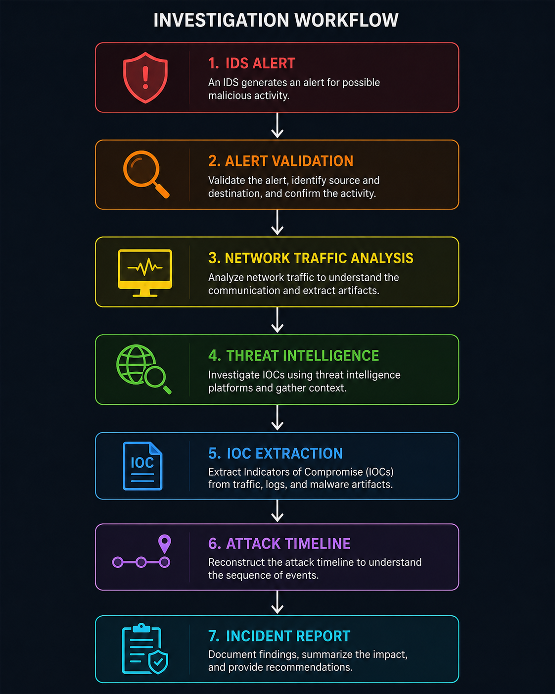
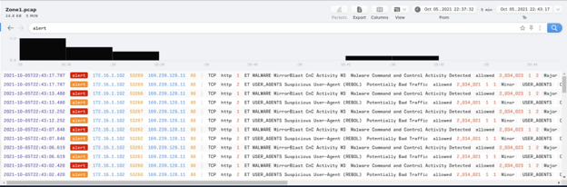
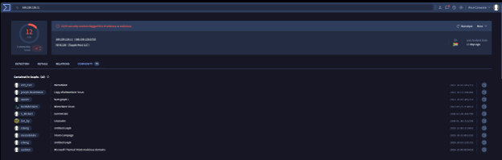
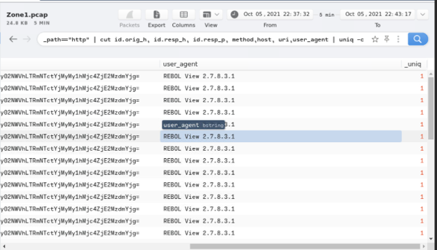
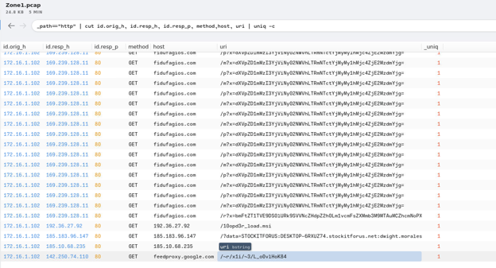
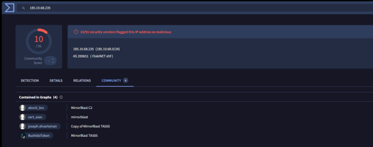
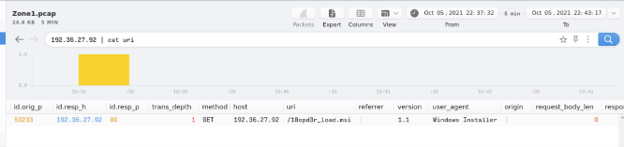
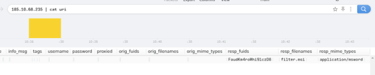

# Malware Command & Control Investigation (TryHackMe — Warzone)

This project documents the investigation of a simulated **Malware Command & Control (C2)** incident from the TryHackMe *Warzone* room.

The objective was to validate the security alert, analyze captured network traffic, investigate malicious infrastructure using threat intelligence, extract Indicators of Compromise (IOCs), and reconstruct the attack timeline following a SOC analyst investigation workflow.

# Investigation Workflow

# Initial Alert

The investigation began after an IDS generated a **Malware Command and Control Activity Detected** alert.

The first step was to validate the alert, identify the communicating hosts, and determine whether the activity represented a true positive.

# Alert Investigation

The source and destination IP addresses were identified, allowing the investigation to focus on the affected host and malicious infrastructure.

Key information extracted:

- Source IP
- Destination IP
- Alert Signature
- Communication Protocol

# Threat Intelligence

The malicious IP and related domain were investigated using **VirusTotal**.

The investigation identified:

- Malware family
- Threat actor attribution
- Community reports
- Communicating file types

# Network Traffic Analysis

The captured traffic was inspected to understand how the malware communicated with its Command & Control server.

Analysis included:

- HTTP requests
- HTTP responses
- User-Agent identification
- Downloaded files

# User-Agent Analysis

The HTTP User-Agent was extracted from the captured traffic to help identify the malware's communication pattern.

This artifact can also be useful for creating detection rules within IDS, SIEM, or proxy logs.

# Malware Delivery

The downloaded payloads were identified and analyzed.

The investigation determined:

- Downloaded filenames
- Download URLs
- Destination directories
- Execution path

# Malware Artifacts

The final stage reconstructed the malware installation on the compromised system.

Recovered artifacts included:

- Installation directories
- Executable names
- Additional dropped files

# Indicators of Compromise (IOC)

The investigation produced the following IOC categories:

- Source IP
- Destination IP
- Domains
- HTTP User-Agent
- Malware family
- Downloaded payloads
- File paths
- IDS alert signature

# Tools Used

| Category | Tool |
|----------|------|
| Network Analysis | Wireshark |
| Threat Intelligence | VirusTotal |
| Detection | IDS |
| Investigation | TryHackMe |
| Malware Analysis | VirusTotal Community |

# Skills Practiced

- IDS alert triage
- Network traffic analysis
- HTTP protocol analysis
- Threat intelligence investigation
- IOC extraction
- Malware Command & Control investigation
- Incident response methodology
- SOC investigation workflow

# MITRE ATT&CK

Examples of techniques demonstrated during this investigation:

- **T1071.001** – Application Layer Protocol: Web Protocols
- **T1105** – Ingress Tool Transfer
- **T1583** – Acquire Infrastructure
- **T1102** – Web Service
- **T1071** – Application Layer Protocol