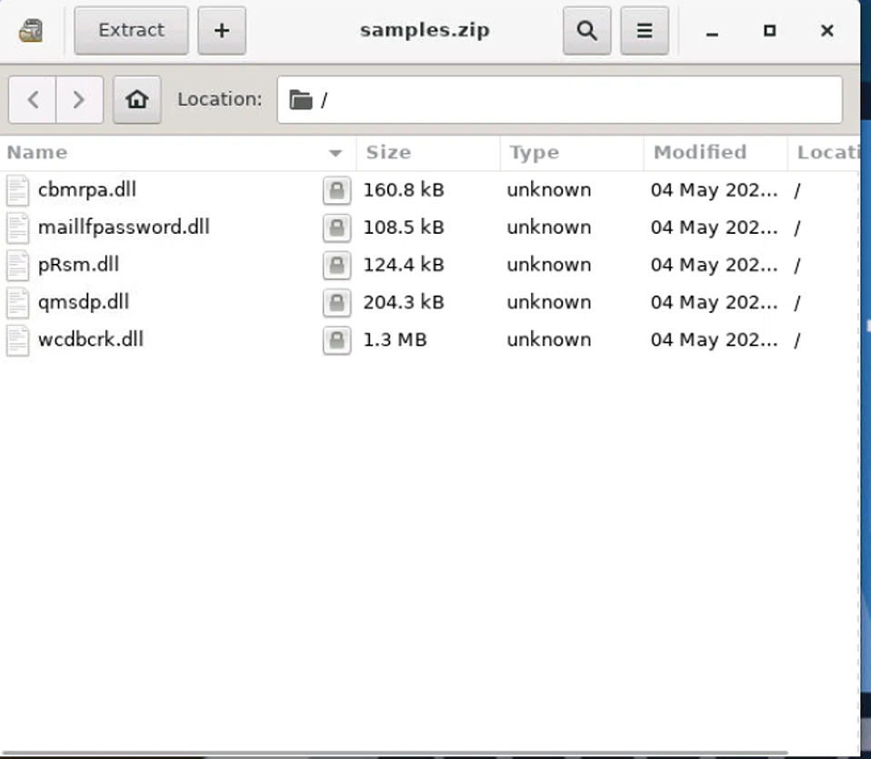
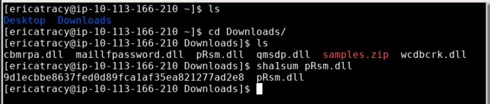
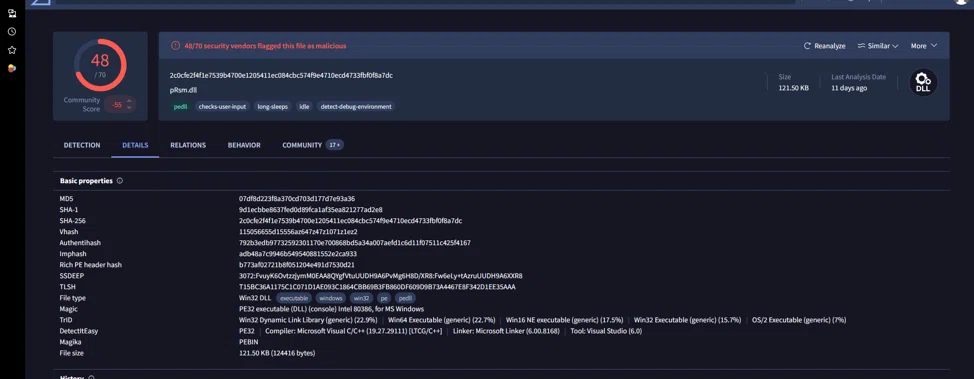
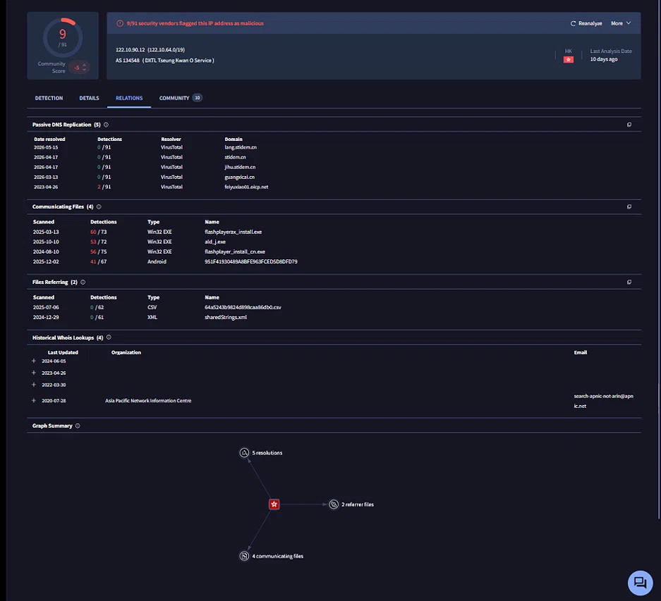

# Malware Sample Analysis — MgBot / Daggerfly

**Incident Type:** Malware Analysis / Advanced Persistent Threat (APT)
**Status:** Completed
**Date of Analysis:** 20 June 2026

## Executive Summary

A malware sample delivered via a phishing email (`samples.zip`) was submitted for static and dynamic analysis. The file, identified as `pRsm.dll`, was confirmed as **MgBot** — a modular backdoor malware family attributed to the **Daggerfly** threat actor (suspected). Static analysis identified the file's hashes and compiler signature; dynamic analysis revealed PowerShell-based execution, registry-based persistence, and outbound C2 communication to `122.10.90.12`. The sample also exhibited audio-capture and credential-access capabilities consistent with MgBot's known modular toolset. The finding was escalated per L1 containment procedures, with C2 infrastructure blocked at the perimeter.

## Investigation Workflow

The investigation followed a structured malware-analysis approach:

1. **Archive & File Identification** – extract and hash the delivered payload.
2. **Static Analysis** – determine compiler, malware family, and threat actor attribution via VirusTotal.
3. **Dynamic Analysis** – observe process creation, persistence, and network behavior in a sandboxed environment.
4. **Network Analysis** – identify and validate C2 infrastructure.
5. **IoC Extraction** – compile indicators for detection and blocking.
6. **MITRE ATT&CK Mapping** – classify observed techniques.
7. **Containment & Remediation** – recommend immediate and long-term actions.

## 1. File Identification & Static Analysis

The delivered archive (`samples.zip`) contained a single key file, `pRsm.dll`. Hashing and static inspection were performed before any dynamic execution.

**Key File: `pRsm.dll`**

| Attribute | Value |
|-----------|-------|
| **SHA1** | `9d1ecb8e637fed0d89fca1af35ea821277ad2e8` |
| **SHA-256** | `2c0cfe2f4f1e7539b4700e1205411ec084cbc574f9e4f1dce4d733fbf0f8a7dc` |
| **Imphash** | `8d4b7a7c994b5b495d40881552e2c9d33` ⚠️ *(recheck length against source — appears shorter than a standard 32-char hex value)* |
| **SSDEEP** | `3072:PyuyK6Ovtzjy0m0EAQvQfVtUuUDH9A6PvM6H8O/XR8:fw6eLy+AznuUUDH9A6OXR8` |
| **Compiler** | Microsoft Visual C/C++ (19.27.29111) |
| **Malware Family** | MgBot |
| **Threat Actor** | Daggerfly (suspected) |

*Figure 1 — 48 out of 70 antivirus engines detect pRsm.dll as malicious*

## 2. Dynamic Analysis

Executing the sample in an isolated sandbox revealed the following behavior:

| Behavior | Details |
|----------|---------|
| **Process Creation** | `powershell -e ...` (encoded command) |
| **Persistence** | Registry Run key modifications detected |
| **Network Connections** | C2 communication to `122.10.90.12` |
| **File System Activity** | Dropped additional modules in `%TEMP%` |
| **Registry Modifications** | Added auto-start entries |

The use of an encoded PowerShell command as the initial execution vector is a common evasion technique intended to bypass simple command-line signature detection.

## 3. Network Analysis — C2 Infrastructure

**C2 Infrastructure:**

| Type | Value | First Seen | Notes |
|------|-------|------------|-------|
| **IP Address** | `122.10.90.12` | 2020-09-14 | MgBot C&C server (AS55933 Cloudie Limited) |
| **Download URL** | `http://update.browser.qq.com/qmbs/QQ/QQUrlMgr_QQ88_4296.exe` | 2020-11-02 | Malicious download location |

**Defanged (Safe) Formats:**

| Original | Defanged |
|----------|----------|
| `http://update.browser.qq.com/qmbs/QQ/QQUrlMgr_QQ88_4296.exe` | `hxxp://update[.]browser[.]qq[.]com/qmbs/QQ/QQUrlMgr_QQ88_4296[.]exe` |
| `122.10.90.12` | `122[.]10[.]90[.]12` |

*Figure 2 — IP 122.10.90.12 confirmed as MgBot C2 server on VirusTotal*

## 4. Indicators of Compromise (IoC)

| Type | Value | First Seen | Notes |
|------|-------|------------|-------|
| **SHA-256** | `2c0cfe2f4f1e7539b4700e1205411ec084cbc574f9e4f1dce4d733fbf0f8a7dc` | 2023-05-18 | pRsm.dll |
| **SHA1** | `9d1ecb8e637fed0d89fca1af35ea821277ad2e8` | 2023-05-18 | pRsm.dll |
| **Imphash** | `8d4b7a7c994b5b495d40881552e2c9d33` | 2023-05-18 | pRsm.dll |
| **IP** | `122.10.90.12` | 2020-09-14 | C&C server |
| **Domain** | `update.browser.qq.com` | 2020-11-02 | Malicious download domain |
| **URL** | `http://update.browser.qq.com/qmbs/QQ/QQUrlMgr_QQ88_4296.exe` | 2020-11-02 | Payload download |

## 5. MITRE ATT&CK Mapping

| Technique | Tactic | ID | Evidence |
|-----------|--------|----|----------|
| Phishing | Initial Access | T1566.001 | samples.zip delivered via email |
| PowerShell | Execution | T1059.001 | `powershell -e ...` |
| Audio Capture | Collection | T1123 | Audio recorder plug-in |
| Credential Dumping | Credential Access | T1003.001 | LSASS access (Sysmon 10) |
| Command and Control | C2 | T1071.001 | HTTP traffic to `122.10.90.12` |
| Exfiltration | Exfiltration | T1041 | Data theft via C2 channel |

## 6. Conclusion & Recommendations

Static and dynamic analysis confirmed `pRsm.dll` as a MgBot backdoor sample, attributed with moderate confidence to the Daggerfly threat actor. The malware achieved execution via encoded PowerShell, established registry-based persistence, and communicated with a confirmed C2 server. Its modular capabilities — audio capture and credential access in particular — indicate this family is built for sustained espionage rather than opportunistic infection, and any live detection should be treated as high-priority.

**Immediate Actions (L1):**
1. **Isolate infected hosts** from network to prevent lateral movement.
2. **Disable compromised user accounts** pending password reset.
3. **Block C2 IP** (`122.10.90.12`) at perimeter firewall.
4. **Block download domain** (`update.browser.qq.com`) at DNS level.
5. **Collect memory dumps and logs** for L2 analysis.

**Long-term Recommendations:**
1. **Deploy YARA rules** for MgBot detection.
2. **Enable PowerShell ScriptBlockLogging** across all endpoints.
3. **Create SIEM rule** for `powershell -e` with child process correlation.
4. **Update email gateway policies** to block macro-enabled Office files from external senders.
5. **Conduct user awareness training** on phishing email recognition.

**Lessons Learned:**
1. **Phishing remains the primary vector** — email filtering should be strengthened.
2. **PowerShell logging is critical** — encoded commands are a common evasion technique.
3. **MITRE ATT&CK mapping** helps prioritize response actions (e.g., T1123 indicates data exfiltration risk beyond simple backdoor access).
4. **Threat Intelligence (TI) correlation** (VirusTotal, MISP) is essential for identifying known malware families like MgBot.
5. **SOC L1 must escalate quickly** — MgBot's modular, chain infection capability could lead to further compromise if left unaddressed.

## References

- [TryHackMe Room: Friday Overtime](https://tryhackme.com/room/fridayovertime)
- [MITRE ATT&CK T1123 — Audio Capture](https://attack.mitre.org/techniques/T1123/)
- [MITRE ATT&CK T1566.001 — Phishing](https://attack.mitre.org/techniques/T1566/001/)
- [PCrisk MgBot Removal Guide](https://www.pcrisk.com/removal-guides/26586-mgbot-malware)
- [VirusTotal Report](https://www.virustotal.com)